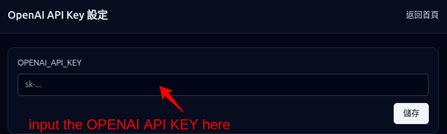

# makeslide


語音簡報生成與播放系統。
Voice presentation generation and playback system.

這個專案提供類似 NotebookLM 影片生成的工作流：可接受 PDF，抽取頁面圖片與文字，產生逐字稿，再合成語音。也支援以簡報大綱（例如 ChatGPT 產生、以 `## Slide XX` 分頁）直接產圖、產稿、配音。
This project provides a NotebookLM-like video/presentation workflow: ingest PDF, extract page images and text, generate narration scripts, then synthesize speech. It also supports outline-driven generation (for example, ChatGPT output split by `## Slide XX`) to create images, scripts, and audio.

請使用下面連結取得 demo

Please use the following links for online demo.

http://120.126.23.25:12345/notebook/aictest001/m4/

account/pass: demo/demo

You can use the docker image from docker hub wycca1/makeslide-app:v1.1.


## 文件導覽 / Documentation

- 使用者操作教學：[`docs/userguide.md`](docs/userguide.md)
  User guide for setup, upload workflows, playback, editing, and realtime poll.
- 系統設計：[`docs/design.md`](docs/design.md)
  Architecture and processing pipeline design notes.
- 錯誤碼與使用者提示：[`docs/error-codes.md`](docs/error-codes.md)
  Error codes and recommended user-facing actions.
- Pipeline 階段與頁面耗時：[`docs/pipeline-stage-and-page-timing.md`](docs/pipeline-stage-and-page-timing.md)
  Timing event and page duration reference.

## Docker 啟動 / Run with Docker

```bash
mkdir -p home1
docker run -d -v home1:/home/jovyan/ -p 8888:8888 wycca1/makeslide:latest
```

啟動後在瀏覽器開啟下列網址，並輸入 OpenAI API key 即可開始使用。
After starting the container, open the following URL in your browser and enter your OpenAI API key to start using the application.

```text
http://127.0.0.1:8888/
```



## 目錄結構 / Project Structure

```text
makeslide/
├── backend/       # Fastify + TypeScript API server
├── frontend/      # React + Vite + Tailwind SPA
├── storage/       # 執行期產物（gitignored）/ runtime artifacts (gitignored)
│   └── <pdf_id>/
│       ├── source.pdf
│       ├── metadata.json
│       ├── cover.png
│       └── pages/
│           ├── 001.png
│           ├── 001.text.txt
│           └── ...
├── data/          # SQLite DB 檔案（gitignored）/ SQLite DB files (gitignored)
└── docs/
```

## 前置需求 / Prerequisites

- Node.js 20 LTS+
- npm 10+
- **poppler-utils**（提供 `pdftoppm` 與 `pdfinfo`，供 PDF 轉圖）
  **poppler-utils** (provides `pdftoppm` and `pdfinfo` for PDF-to-image rendering)
  - Ubuntu / Debian: `sudo apt-get install poppler-utils`
  - macOS: `brew install poppler`
  - 驗證 / Verify: `pdftoppm -v`、`pdfinfo -v`

若未安裝 poppler，backend 啟動時會警告，上傳 PDF 後會進入 `failed`，並在 `error_message` 說明。
If poppler is missing, backend will warn at startup; uploaded PDFs may enter `failed` with details in `error_message`.

## 快速啟動（推薦）/ Quick Start (Recommended)

1. 建議使用 [nvm](https://github.com/nvm-sh/nvm)（專案附 [` .nvmrc `](.nvmrc) 鎖定 Node 20）。
   Use [nvm](https://github.com/nvm-sh/nvm) (project includes [`.nvmrc`](.nvmrc) targeting Node 20).

   ```bash
   curl -o- https://raw.githubusercontent.com/nvm-sh/nvm/v0.40.1/install.sh | bash
   # 開新 shell 後 / after opening a new shell:
   nvm install 20 && nvm use 20
   ```

2. 複製環境變數並填入 `OPENAI_API_KEY`。
   Copy env file and set `OPENAI_API_KEY`.

   ```bash
   cp .env.example .env
   # 編輯 .env / edit .env
   ```

3. 一鍵啟動（檢查 Node / poppler / .env，建立目錄，必要時安裝套件，啟動前後端）。
   Start with one command (checks Node/poppler/.env, prepares directories, installs deps if needed, starts backend + frontend).

   ```bash
   ./start.sh
   ```

可用選項 / Available options:

```bash
./start.sh --help             # 列出所有選項 / show all options
./start.sh --install          # 強制重新 npm install / force npm install
./start.sh --clean            # 清除 node_modules 後重裝並啟動 / reinstall from clean state
./start.sh --backend-only     # 只啟動 backend / backend only
./start.sh --frontend-only    # 只啟動 frontend / frontend only
```

按 `Ctrl+C` 可優雅終止子程序。
Press `Ctrl+C` for graceful shutdown.

## 手動啟動（備選）/ Manual Start (Alternative)

若不使用 [`start.sh`](start.sh)：
If you do not use [`start.sh`](start.sh):

```bash
cp .env.example .env
npm install
npm run dev
```

`npm install` 會安裝 backend/frontend（npm workspaces）。
`npm install` installs both backend and frontend via npm workspaces.

- Backend: `http://localhost:3000`
- Frontend: `http://localhost:5173`（dev server 會把 `/api` proxy 到 backend）
  Frontend dev server proxies `/api` to backend.

也可分別啟動 / You can also run separately:

```bash
npm run dev:backend
npm run dev:frontend
```

## 已實作 API / Implemented API

| Method | Path | 說明（中文） | Description (EN) |
|---|---|---|---|
| GET | `/api/health` | 健康檢查 | Health check |
| POST | `/api/pdfs` | 上傳 PDF（`multipart/form-data`，欄位 `file`） | Upload PDF (`multipart/form-data`, field `file`) |
| GET | `/api/pdfs` | 列出 PDF（含封面與進度） | List PDFs (with cover and progress) |
| GET | `/api/pdfs/:id` | 取得單筆詳情（含頁面資源 URL） | Get PDF detail (with page asset URLs) |
| GET | `/api/pdfs/:id/cover` | 取得封面縮圖 | Get cover thumbnail |
| GET | `/api/pdfs/:id/pages/:n/image` | 取得第 n 頁影像 | Get page image |
| GET | `/api/pdfs/:id/pages/:n/text` | 取得第 n 頁文字 | Get extracted page text |
| DELETE | `/api/pdfs/:id` | 刪除 PDF 與相關產物 | Delete PDF and related artifacts |

## 處理管線 / Processing Pipeline

```text
上傳 / Upload → awaiting_prompt（可選，等待使用者提示）
               ↓ start
               uploaded → processing
               ↓
               rendering / extracting_text / generating_script / synthesizing_audio / generating_title
               ↓
               ready（或 failed）
```

- 背景佇列 / Queue: `p-queue`（並行數由 `PROCESS_CONCURRENCY` 控制）
  Concurrency is controlled by `PROCESS_CONCURRENCY`.
- 崩潰復原：啟動時會重新入列 `uploaded/processing`。
  Crash recovery: re-enqueues PDFs in `uploaded/processing` on startup.
- 同一 `pdf_id` 不重複處理。
  The same `pdf_id` is guarded against duplicate processing.

## 環境變數 / Environment Variables

請見 [`.env.example`](.env.example)。核心變數如下：
See [`.env.example`](.env.example). Core variables:

| 變數 / Variable | 預設 / Default | 說明（中文） | Description (EN) |
|---|---:|---|---|
| `PORT` | `3000` | Fastify 監聽埠 | Fastify listening port |
| `STORAGE_ROOT` | `./storage` | 產物根目錄 | Artifact root directory |
| `DB_PATH` | `./data/app.db` | SQLite 路徑 | SQLite DB path |
| `MAX_UPLOAD_MB` | `50` | 上傳大小上限 | Upload size limit |
| `LOG_LEVEL` | `info` | 日誌等級 | Log level |
| `PROCESS_CONCURRENCY` | `2` | 同時處理 PDF 數 | Number of PDFs processed concurrently |
| `RENDER_DPI` | `150` | PDF 轉圖解析度 | PDF rendering DPI |
| `POPPLER_BIN_PATH` | `` | poppler bin 目錄（空值表示用 PATH） | poppler bin directory (empty means use PATH) |

## 相關文件 / Additional Docs

請見上方「文件導覽 / Documentation」。
See the “Documentation” section above.
