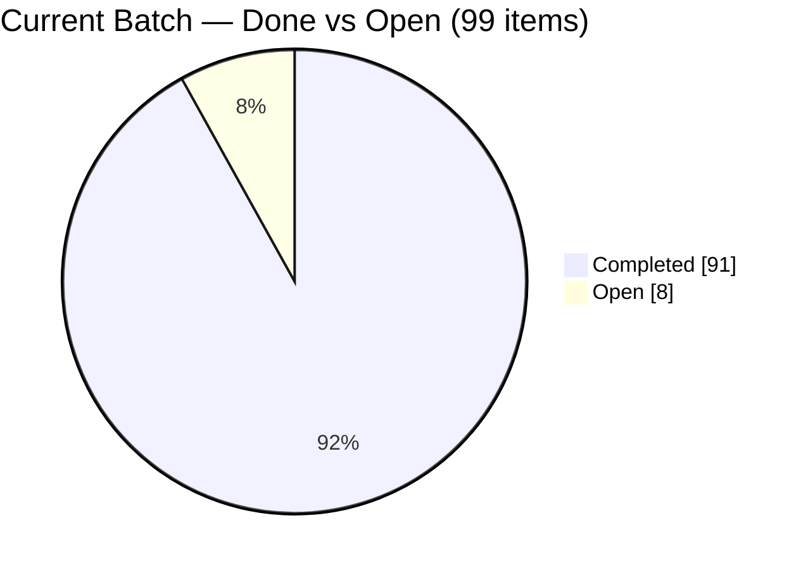
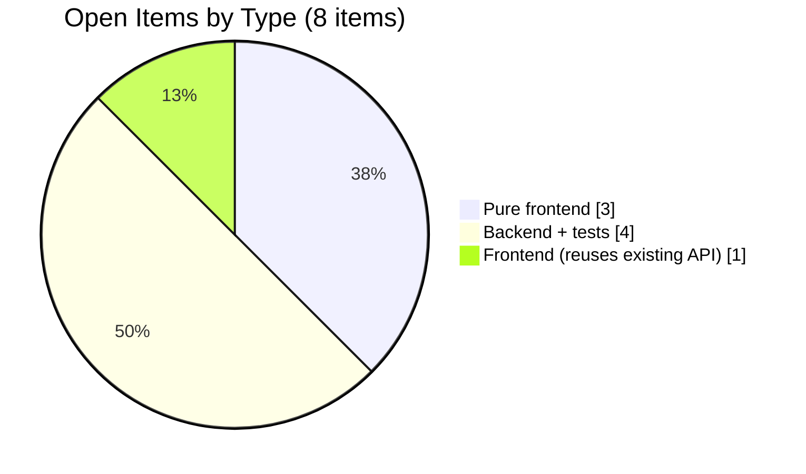
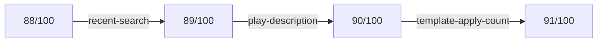

# MakeSlide — TODO Completion Analysis Report

**Generated:** 2026-06-25
**Branch:** master
**Source:** `TODO.md`

---

## 1. Executive Summary

The project's task backlog is in a near-complete state. Against the
LOOP.md cap of **100 items per counting cycle**, the current cycle stands at
**91 / 100 completed (91%)**, with only **8 open items** remaining before the
cycle hits its stop threshold. Across the entire `TODO.md` history, **252 tasks**
have been marked done.

The remaining work is low-risk: every open item reuses existing tables, routes,
or services, and only one requires an external LLM call.

---

## 2. Overall Completion

| Metric | Value |
|--------|-------|
| Total completed `[x]` (whole file) | **252** |
| Open `[ ]` items | **8** |
| Last "count reset" marker | line 573 |
| Completed since last reset | **91** |
| Cycle threshold (LOOP.md) | 100 |
| Remaining budget before stop | **9** |

### Current Cycle Progress (toward 100-item cap)

```
91 / 100  ███████████████████████████████████████████░░░░  91%
```

### Current Batch (91 done + 8 open = 99)

```
done 91   ████████████████████████████████████████████░░  92%
open  8   ████░░                                            8%
```

---

## 3. Done vs. Open



---

## 4. Remaining Work Breakdown

The 8 open items grouped by implementation surface:



### Detailed Open-Item Table

| # | Item | Surface | Effort | Risk | Notes |
|---|------|---------|--------|------|-------|
| 1 | Quiz result share button | Frontend | Low | Low | `navigator.share` + clipboard fallback |
| 2 | Class report print stylesheet | Frontend | Low | Low | `window.print()` + `@media print` |
| 3 | Play-page keyboard shortcuts overlay | Frontend | Low | Low | Modal listing existing shortcuts |
| 4 | AI one-click fill empty scripts | Frontend (reuses API) | Medium | Low | Loops existing regenerate-script API |
| 5 | Settings semantic-index stats | Backend + tests | Medium | Low | New `GET /api/me/embedding-stats` |
| 6 | Similar-pages recommendation | Backend + tests | Medium | Low | Cosine over existing `page_embeddings` |
| 7 | Auto-generate PDF description | Backend + tests | Medium | **Med** | New endpoint, **LLM call (cost)** |
| 8 | Post-class report watch-rate | Backend + tests | Medium | Low | JOIN existing `watch_progress` table |

### Effort Distribution

```
Low effort     ███████████████  3 items   (pure frontend)
Medium effort  █████████████████████████  5 items   (1 FE-integration + 4 BE)
```

### Risk Profile

```
Low risk   ███████████████████████████████████  7 items
Med risk   █████                                1 item   (LLM cost: auto-description)
```

---

## 5. Recent Velocity

`TODO.md` records **27 work-log rounds** and has reached the **32nd scan round**.
During the most recent automated loop session (2026-06-25), **3 items** were
completed back-to-back, each on its own branch and merged to `master`:

| Date | Item | Branch |
|------|------|--------|
| 2026-06-25 | Remove individual recent-search entries | `feat/recent-search-remove-item` |
| 2026-06-25 | Collapsible PDF description on play page | `feat/play-description-collapse` |
| 2026-06-25 | Template usage-count badge | `feat/template-apply-count` |



---

## 6. Recommendations

1. **Clearing the batch is feasible within budget.** 8 open items vs. 9 remaining
   budget — finishing all of them lands exactly at/just under the 100 cap, at which
   point LOOP.md requires stopping for a human decision on resetting the counter.

2. **Sequence by cost/risk.** Tackle the 3 pure-frontend items and the 4 backend
   items reusing existing tables first; defer **auto-generate PDF description**
   (item 7) since it is the only one incurring LLM/API cost.

3. **No architectural blockers.** None of the remaining items introduce new
   external dependencies, so they can be parallelized across branches safely.

4. **Plan the reset.** Since the cycle is at 91%, decide ahead of time whether the
   next loop should reset the counter (continue with a fresh 100) or pause after
   the batch is cleared.

---

*Report compiled from `TODO.md` markers; counts verified via `grep`/`git`.*
