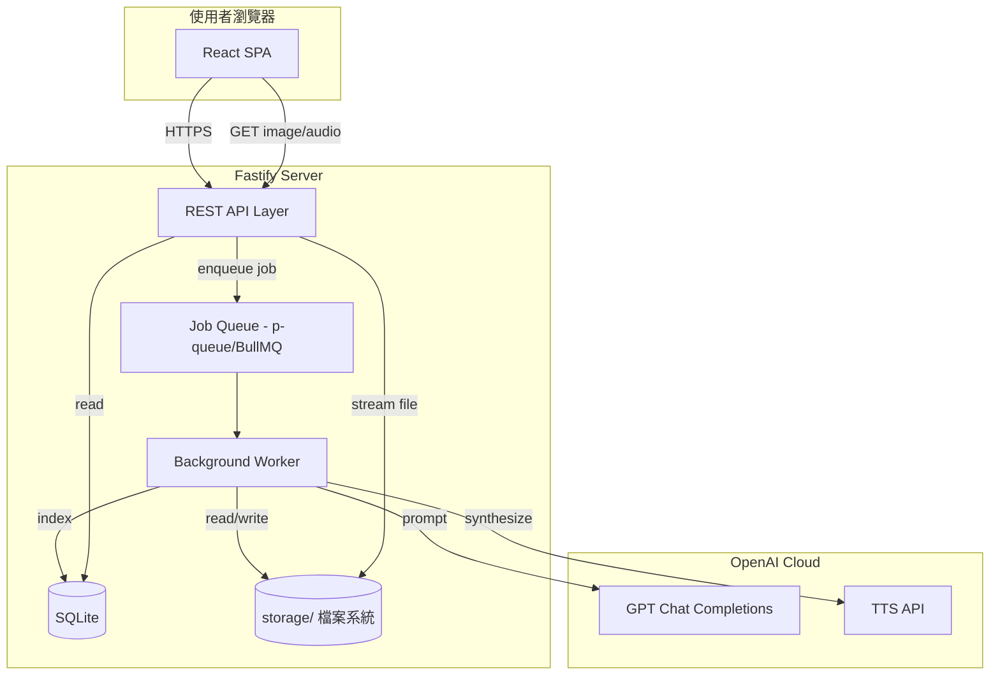
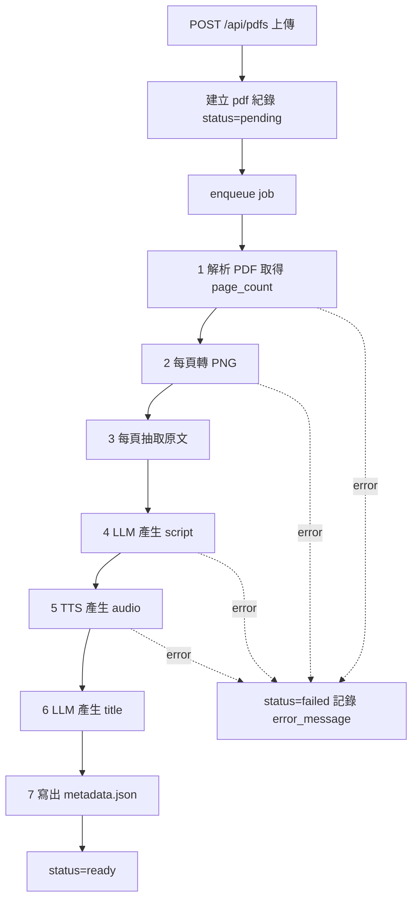
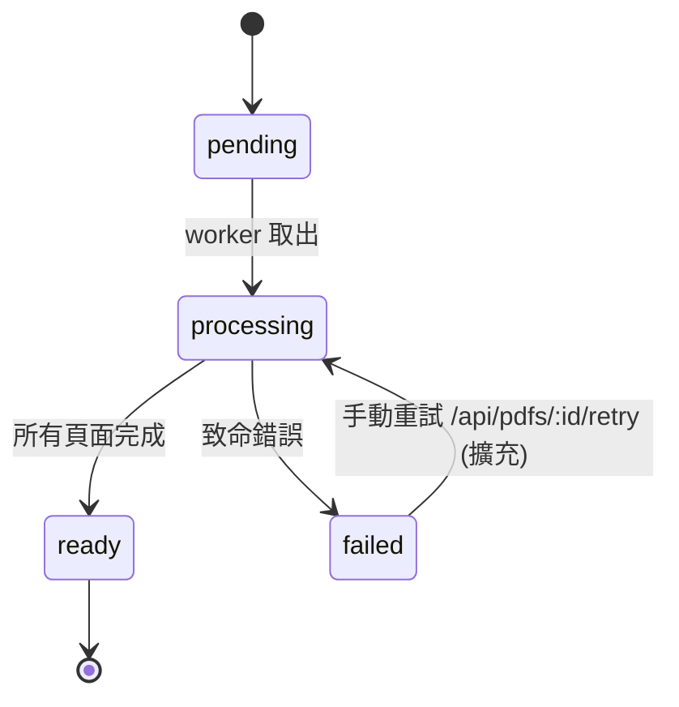

# PDF 語音簡報生成與播放系統 — 設計文件

> 版本：v0.1（初版設計草案）
> 語言：繁體中文
> 狀態：待審閱

---

## 目錄

1. [系統概述（Overview）](#1-系統概述overview)
2. [技術選型（Tech Stack）](#2-技術選型tech-stack)
3. [系統架構（Architecture）](#3-系統架構architecture)
4. [資料模型（Data Model）](#4-資料模型data-model)
5. [目錄結構（Storage Layout）](#5-目錄結構storage-layout)
6. [API 設計（REST API）](#6-api-設計rest-api)
7. [處理流程（Processing Pipeline）](#7-處理流程processing-pipeline)
8. [前端頁面設計（UI）](#8-前端頁面設計ui)
9. [設定與環境變數（Configuration）](#9-設定與環境變數configuration)
10. [非功能需求（NFR）](#10-非功能需求nfr)
11. [未來擴充](#11-未來擴充)
12. [里程碑與實作階段（Milestones）](#12-里程碑與實作階段milestones)

---

## 1. 系統概述（Overview）

### 1.1 目的

本系統為「**PDF 語音簡報生成與播放平台**」，允許使用者上傳 PDF 檔案，由系統自動為每頁生成**逐字講稿（speaker script）**，再以 OpenAI TTS 合成對應語音檔。使用者可於網頁以 Grid 方式瀏覽所有已處理之簡報，並進入播放頁以「投影片圖像 + 同步語音」的方式聆聽，語音結束後自動切換下一頁。

### 1.2 使用情境

- **教學／訓練**：講師上傳教材 PDF，系統自動產生旁白，供學員線上自主學習。
- **自動化簡報**：會議或研討會的靜態 PDF 投影片，轉為具語音旁白的線上展示。
- **內容複習**：學生上傳課堂講義，由 AI 生成摘要講稿輔助複習。
- **無障礙閱讀**：為視障或閱讀不便者提供 PDF 的語音化版本。

### 1.3 主要使用者流程（User Flow）


### 1.4 主要功能

| 編號 | 功能 | 說明 |
|-----|------|------|
| F1 | PDF 上傳 | 支援單一 PDF 檔上傳，驗證副檔名與大小 |
| F2 | 逐字腳本生成 | 透過 LLM 依每頁內容生成 speaker script |
| F3 | 語音合成 | 透過 OpenAI TTS 產生每頁 mp3 |
| F4 | 檔案儲存 | 以 `storage/<pdf_id>/` 結構化保存 |
| F5 | 標題自動生成 | 由 LLM 依整份內容產生簡短標題 |
| F6 | Grid 瀏覽 | 首頁以網格呈現標題 + 封面縮圖 |
| F7 | 同步播放 | 進入播放頁，圖像與音檔同步切換 |

---

## 2. 技術選型（Tech Stack）

### 2.1 總覽

| 類別 | 技術 | 說明 |
|------|------|------|
| 後端語言 | **TypeScript 5.x (Node.js 20 LTS)** | 型別安全、與前端共用型別定義 |
| 後端框架 | **Fastify** | 效能優於 Express、內建 JSON schema 驗證 |
| 前端 | **React 18 + Vite** | 現代化開發體驗、快速 HMR；亦可退化為純 HTML/JS |
| 前端樣式 | **TailwindCSS** | 快速實作 Grid / 卡片式 UI |
| 資料儲存 | **檔案系統 + SQLite（better-sqlite3）** | 簡化部署；日後可替換為 Postgres |
| 任務佇列 | **BullMQ（以 Redis 為 broker）**，或最小化採 **內建 in-process queue（p-queue）** | MVP 可用 in-process，擴充時切 BullMQ |
| PDF 轉圖 | **pdf2pic + poppler-utils（pdftoppm）** | 穩定、品質佳；輸出每頁 PNG |
| PDF 文字抽取 | **pdf-parse** 或 **pdfjs-dist** | 抽取每頁純文字供 LLM 參考 |
| LLM | **OpenAI GPT**（如 `gpt-4o-mini`） | 生成逐字稿與標題 |
| TTS | **OpenAI TTS**（如 `gpt-4o-mini-tts` 或 `tts-1`） | 每頁合成 mp3 |
| 驗證 | **zod** | 統一 request/schema 驗證 |
| 測試 | **Vitest**（單元/整合）+ **Playwright**（E2E） | 與工作區慣例一致 |
| 日誌 | **pino**（Fastify 預設） | 結構化 log |
| 程序管理 | **pm2 / systemd**（部署時） | 常駐背景 worker |

### 2.2 選擇理由

- **Node.js/TypeScript + Fastify**：前後端使用同一語言，型別共享；Fastify 具高效能與良好的插件生態。
- **檔案系統 + SQLite**：MVP 無需架設資料庫伺服器；`storage/<pdf_id>/` 目錄即為原始資產，SQLite 僅保存索引與狀態。
- **pdf2pic（poppler-utils）**：轉圖品質與相容性佳；較 pure-JS 方案穩定。
- **pdf-parse**：純 JS 實作，文字抽取即時可用；若頁面為掃描影像則需後續 OCR（MVP 不列入）。
- **OpenAI GPT / TTS**：使用者需求明確指定 OpenAI；模型以 `gpt-4o-mini` 平衡成本與品質，TTS 以 `gpt-4o-mini-tts` 為預設。

### 2.3 套件清單（預計 dependencies）

```text
# 後端核心
fastify, @fastify/multipart, @fastify/static, @fastify/cors
zod, pino, dotenv

# PDF 處理
pdf-parse, pdf2pic

# 資料與佇列
better-sqlite3, p-queue
# 進階: bullmq, ioredis

# 第三方
openai

# 測試
vitest, @vitest/coverage-v8, playwright

# 前端
react, react-dom, react-router-dom, vite, tailwindcss
```

> 系統相依：`poppler-utils`（`pdftoppm`）需於主機層先行安裝。

---

## 3. 系統架構（Architecture）

### 3.1 高階架構圖



### 3.2 非同步處理模型

- **上傳 API** 接收 PDF 後立即回傳 `pdf_id`，並將工作丟入 Job Queue。
- **Worker** 依序執行「轉圖 → 抽文字 → 產生 script → 合成語音 → 產生標題 → 標記完成」。
- 每個處理階段都會更新 SQLite 中的 `status` 與 `progress` 欄位，供前端輪詢。
- 單一 PDF 內的各「頁」處理可再平行化（受並行上限保護）。

### 3.3 模組分層（後端）

```text
backend/
├── src/
│   ├── app.ts                 # Fastify 實例、plugin 註冊
│   ├── server.ts              # 啟動 HTTP
│   ├── routes/                # REST 路由
│   │   ├── pdfs.ts
│   │   └── health.ts
│   ├── services/              # 業務邏輯
│   │   ├── pdfService.ts
│   │   ├── scriptService.ts   # 呼叫 GPT
│   │   ├── ttsService.ts      # 呼叫 TTS
│   │   └── titleService.ts
│   ├── pipeline/
│   │   ├── queue.ts           # p-queue / BullMQ wrapper
│   │   └── worker.ts          # 主處理流程
│   ├── db/
│   │   ├── schema.sql
│   │   └── index.ts           # better-sqlite3
│   ├── storage/
│   │   └── fs.ts              # 路徑規則
│   ├── types/
│   └── config.ts
└── tests/
```

---

## 4. 資料模型（Data Model）

### 4.1 實體概念

- `Pdf`：一份上傳的 PDF。
- `Page`：屬於某 `Pdf` 的一頁（含圖像、文字、腳本、語音）。
- `Job`（可選）：背景任務記錄。

### 4.2 SQLite 結構

```sql
CREATE TABLE pdfs (
    id              TEXT PRIMARY KEY,        -- UUID
    title           TEXT,                    -- 由 LLM 生成
    original_name   TEXT NOT NULL,           -- 上傳時原始檔名
    status          TEXT NOT NULL,           -- pending|processing|ready|failed
    page_count      INTEGER DEFAULT 0,
    cover_page      INTEGER DEFAULT 1,       -- 作為縮圖的頁碼
    error_message   TEXT,
    created_at      TEXT NOT NULL,           -- ISO 8601
    updated_at      TEXT NOT NULL
);

CREATE TABLE pages (
    pdf_id          TEXT NOT NULL,
    page_number     INTEGER NOT NULL,        -- 從 1 起
    text            TEXT,                    -- 抽取之原文
    script          TEXT,                    -- LLM 產生的逐字稿
    image_path      TEXT,                    -- 相對 storage/
    audio_path      TEXT,
    audio_duration  REAL,                    -- 秒
    status          TEXT NOT NULL,           -- pending|script_ready|audio_ready|failed
    PRIMARY KEY (pdf_id, page_number),
    FOREIGN KEY (pdf_id) REFERENCES pdfs(id) ON DELETE CASCADE
);

CREATE INDEX idx_pdfs_created ON pdfs(created_at DESC);
```

### 4.3 `status` 狀態列舉

**PDF 層級**

| 狀態 | 意義 |
|-----|------|
| `pending` | 已上傳，尚未開始處理 |
| `processing` | Worker 處理中 |
| `ready` | 所有頁面皆完成 |
| `failed` | 任一致命錯誤導致中止 |

**Page 層級**

| 狀態 | 意義 |
|-----|------|
| `pending` | 尚未處理 |
| `image_ready` | 已轉圖 |
| `script_ready` | 已產生逐字稿 |
| `audio_ready` | 已完成 TTS |
| `failed` | 該頁失敗（可單頁重試） |

### 4.4 `metadata.json` 格式

每份 PDF 於 `storage/<pdf_id>/metadata.json` 同步保存（便於離線備援與搬移）：

```json
{
  "id": "f7b2e3d4-1e2a-4a1b-9d3e-abc123456789",
  "title": "深度學習導論 第一講",
  "originalName": "intro-dl.pdf",
  "status": "ready",
  "pageCount": 12,
  "coverPage": 1,
  "createdAt": "2026-05-01T01:00:00Z",
  "updatedAt": "2026-05-01T01:05:32Z",
  "pages": [
    {
      "pageNumber": 1,
      "image": "pages/001.png",
      "script": "pages/001.script.txt",
      "audio": "pages/001.mp3",
      "audioDuration": 23.5,
      "status": "audio_ready"
    }
  ],
  "models": {
    "llm": "gpt-4o-mini",
    "tts": "gpt-4o-mini-tts",
    "voice": "alloy"
  }
}
```

---

## 5. 目錄結構（Storage Layout）

### 5.1 專案結構

```text
makeslide/
├── backend/
├── frontend/
├── storage/                 # runtime 產物（.gitignore）
│   └── <pdf_id>/
│       ├── source.pdf
│       ├── metadata.json
│       ├── cover.png        # 封面縮圖 (= pages/001.png 的縮放版)
│       └── pages/
│           ├── 001.png
│           ├── 001.text.txt
│           ├── 001.script.txt
│           ├── 001.mp3
│           ├── 002.png
│           ├── 002.text.txt
│           ├── 002.script.txt
│           ├── 002.mp3
│           └── ...
├── data/
│   └── makeslide.sqlite
├── docs/
│   └── design.md
└── plans/
```

### 5.2 檔案命名規則

| 檔案 | 路徑 | 用途 |
|------|------|------|
| 原始 PDF | `storage/<pdf_id>/source.pdf` | 上傳檔案原貌 |
| 中繼資料 | `storage/<pdf_id>/metadata.json` | 對應資料表之檔案版本 |
| 封面縮圖 | `storage/<pdf_id>/cover.png` | Grid 顯示用（max 400px 寬） |
| 頁面圖像 | `storage/<pdf_id>/pages/NNN.png` | NNN 為 3 位零填 |
| 原文抽取 | `storage/<pdf_id>/pages/NNN.text.txt` | 供 LLM 參考的原 PDF 文字 |
| 逐字稿 | `storage/<pdf_id>/pages/NNN.script.txt` | LLM 產出 |
| 語音檔 | `storage/<pdf_id>/pages/NNN.mp3` | TTS 產出 |

> **安全提示**：路徑均以 `pdf_id`（UUID）隔離；API 層以白名單比對 `page_number` 與副檔名，拒絕任何包含 `..` 的請求。

---

## 6. API 設計（REST API）

### 6.1 通用約定

- Base URL：`/api`
- Content-Type：除檔案上傳外皆為 `application/json`
- 錯誤格式：

```json
{
  "error": {
    "code": "PDF_NOT_FOUND",
    "message": "PDF with id xxx not found"
  }
}
```

### 6.2 端點清單

| Method | Path | 說明 |
|--------|------|------|
| `POST` | `/api/pdfs` | 上傳 PDF |
| `GET` | `/api/pdfs` | 列出所有 PDF |
| `GET` | `/api/pdfs/:id` | 取得詳細資料 |
| `GET` | `/api/pdfs/:id/pages/:n/image` | 取得某頁影像 |
| `GET` | `/api/pdfs/:id/pages/:n/audio` | 取得某頁語音 |
| `GET` | `/api/pdfs/:id/cover` | 取得封面縮圖 |
| `DELETE` | `/api/pdfs/:id` | 刪除整份資料 |

---

### 6.3 `POST /api/pdfs`

**Request**（`multipart/form-data`）

| 欄位 | 型別 | 必填 | 說明 |
|------|------|------|------|
| `file` | File | ✓ | PDF 檔案（MIME 必為 `application/pdf`） |
| `voice` | string |  | TTS 音色，預設 `alloy` |
| `language` | string |  | 產生腳本的語言，預設 `zh-TW` |

**Response 202 Accepted**

```json
{
  "id": "f7b2e3d4-1e2a-4a1b-9d3e-abc123456789",
  "status": "pending",
  "originalName": "intro-dl.pdf",
  "createdAt": "2026-05-01T01:00:00Z"
}
```

**錯誤碼**：`INVALID_MIME`、`FILE_TOO_LARGE`、`INTERNAL_ERROR`

---

### 6.4 `GET /api/pdfs`

**Query**：`?limit=50&offset=0&status=ready`

**Response 200**

```json
{
  "items": [
    {
      "id": "f7b2e3d4-...",
      "title": "深度學習導論 第一講",
      "status": "ready",
      "pageCount": 12,
      "coverUrl": "/api/pdfs/f7b2e3d4-.../cover",
      "createdAt": "2026-05-01T01:00:00Z"
    }
  ],
  "total": 1
}
```

---

### 6.5 `GET /api/pdfs/:id`

**Response 200**

```json
{
  "id": "f7b2e3d4-...",
  "title": "深度學習導論 第一講",
  "originalName": "intro-dl.pdf",
  "status": "ready",
  "pageCount": 12,
  "coverUrl": "/api/pdfs/f7b2e3d4-.../cover",
  "createdAt": "2026-05-01T01:00:00Z",
  "updatedAt": "2026-05-01T01:05:32Z",
  "progress": {
    "imagesDone": 12,
    "scriptsDone": 12,
    "audiosDone": 12
  },
  "pages": [
    {
      "pageNumber": 1,
      "status": "audio_ready",
      "script": "各位同學好，今天我們要談...",
      "imageUrl": "/api/pdfs/f7b2e3d4-.../pages/1/image",
      "audioUrl": "/api/pdfs/f7b2e3d4-.../pages/1/audio",
      "audioDuration": 23.5
    }
  ]
}
```

狀態為 `processing` 時：`pages` 仍依序回傳，未完成欄位為 `null`。

---

### 6.6 `GET /api/pdfs/:id/pages/:n/image`

- 回傳 `image/png`，以 `Content-Disposition: inline` 直接顯示。
- 支援 `ETag` / `Cache-Control: public, max-age=86400`。
- 404：若該頁尚未產生圖像。

### 6.7 `GET /api/pdfs/:id/pages/:n/audio`

- 回傳 `audio/mpeg`（mp3）。
- 支援 HTTP Range（讓 `<audio>` 可 seek）。

### 6.8 `GET /api/pdfs/:id/cover`

- 回傳 `image/png` 封面縮圖；不存在時 fallback 至 `pages/1/image`。

### 6.9 `DELETE /api/pdfs/:id`

- 移除 SQLite 中紀錄與 `storage/<pdf_id>/` 整個目錄。
- **Response 204 No Content**。

---

## 7. 處理流程（Processing Pipeline）

### 7.1 總體流程圖



### 7.2 狀態機（PDF）



### 7.3 步驟細節

| 步驟 | 動作 | 工具 | 失敗處理 |
|-----|------|------|---------|
| 1. Parse | 解析取得頁數與基本 meta | pdf-parse | 中止整份 → `failed` |
| 2. Rasterize | 每頁轉 PNG（DPI=150） | pdf2pic (poppler) | 單頁重試 3 次；逾限記 page.failed，但 PDF 仍繼續 |
| 3. Extract text | pdf-parse 逐頁文字 | pdf-parse | 空字串亦允許（由 LLM 依圖像或頁碼生成） |
| 4. Script | 呼叫 GPT chat.completions | openai | 指數退避 3 次；逾限記 page.failed |
| 5. TTS | 呼叫 `audio.speech.create` | openai | 指數退避 3 次；逾限記 page.failed |
| 6. Title | 依前 3 頁原文彙整請 LLM 產標題 | openai | 失敗則使用 `originalName` 當標題 |
| 7. Finalize | 寫 `metadata.json`、產封面縮圖 | sharp | 失敗 → `failed` |

### 7.4 重試策略

- **網路型錯誤（5xx、timeout）**：指數退避 `1s → 2s → 4s`，最多 3 次。
- **配額錯誤（429）**：`Retry-After` 優先，否則退避至 30s。
- **內容政策錯誤（400 content_policy）**：不重試，記錄原因並標記 page.failed。

### 7.5 並行控制

- 全域：同時處理 **≤ 2 份 PDF**（`PDF_CONCURRENCY`）。
- 單份 PDF 內：同時處理 **≤ 3 頁**（`PAGE_CONCURRENCY`，避開 OpenAI 配額）。

### 7.6 Prompt 設計（節錄）

**逐字稿 Prompt**

```text
你是一位專業簡報員。請依下列投影片內容，以繁體中文寫出第 {page_number} / {total} 頁的逐字稿。
要求：
1. 自然口語，語速適中，長度約 100~200 字。
2. 開頭不要重複說「第幾頁」，除非對脈絡有助益。
3. 不得捏造未於投影片出現的數據。

投影片原文：
{page_text}
```

**標題 Prompt**

```text
根據以下簡報前幾頁的原文，擬一個 8~16 字的繁體中文標題（不加標點）。
內容：
{joined_first_pages_text}
```

---

## 8. 前端頁面設計（UI）

### 8.1 頁面路由

| Path | 元件 | 功能 |
|------|------|------|
| `/` | `HomePage` | Grid 展示所有 PDF，含上傳 |
| `/pdfs/:id` | `PlayerPage` | 同步播放頁 |
| `/pdfs/:id/status`（可選） | `ProcessingPage` | 處理中專屬頁 |

### 8.2 首頁（Grid）Wireframe

```text
┌────────────────────────────────────────────────────────────────┐
│  📚 makeslide                                [ + 上傳 PDF ]     │
├────────────────────────────────────────────────────────────────┤
│  ┌──────────┐  ┌──────────┐  ┌──────────┐  ┌──────────┐        │
│  │  cover   │  │  cover   │  │  cover   │  │ ⏳ 處理中 │        │
│  │  image   │  │  image   │  │  image   │  │  4/12頁  │        │
│  ├──────────┤  ├──────────┤  ├──────────┤  ├──────────┤        │
│  │深度學習  │  │資料結構  │  │雲端架構  │  │intro-dl  │        │
│  │導論第一講│  │第三章    │  │總覽      │  │.pdf      │        │
│  │12 頁     │  │ 8 頁     │  │20 頁     │  │上傳中... │        │
│  └──────────┘  └──────────┘  └──────────┘  └──────────┘        │
│  ┌──────────┐  ┌──────────┐                                    │
│  │ ...      │  │ ...      │                                    │
│  └──────────┘  └──────────┘                                    │
└────────────────────────────────────────────────────────────────┘
```

**互動**

- 點擊卡片：若 `status=ready` → 進入 `/pdfs/:id`；若處理中 → 進入狀態頁並輪詢。
- 卡片右上角顯示狀態徽章：`Ready` / `Processing` / `Failed`。
- 上傳按鈕：開啟 file picker，送出後以 toast 顯示「已加入處理佇列」。
- 首頁每 5 秒輪詢 `GET /api/pdfs` 更新處理狀態。

### 8.3 播放頁 Wireframe

```text
┌────────────────────────────────────────────────────────────────┐
│  ← 返回                    深度學習導論 第一講                 │
├────────────────────────────────────────────────────────────────┤
│                                                                │
│              ┌──────────────────────────────┐                  │
│              │                              │                  │
│              │      投影片圖像 (PNG)        │                  │
│              │                              │                  │
│              │                              │                  │
│              └──────────────────────────────┘                  │
│                                                                │
│  ─────────── 進度 ───────────                                 │
│   Page 3 / 12     ▶ 00:07 / 00:23   ━━━━●─────────              │
│                                                                │
│  ◀ 上一頁   [⏸ 暫停]   [🔁 重播本頁]   下一頁 ▶                │
│                                                                │
│  ┌─── 當前腳本 ────────────────────────────────────────────┐  │
│  │ 各位同學好，今天我們要談深度學習的基本概念，首先是...    │  │
│  │ ...                                                     │  │
│  └─────────────────────────────────────────────────────────┘  │
└────────────────────────────────────────────────────────────────┘
```

**行為設計**

1. 進入頁面：`GET /api/pdfs/:id` 取得所有頁資料。
2. 以 HTML `<audio>` 播放 `audioUrl`，監聽 `ended` 事件：
   - 若非最末頁 → `currentPage += 1`，載入下一頁 image + audio 並 `play()`。
   - 若為最末頁 → 暫停並顯示「播放完畢」。
3. 使用者可點「上一頁 / 下一頁」手動切換；切換時自動載入並續播。
4. 支援鍵盤：`←` / `→` 翻頁、`Space` 播放/暫停。
5. 預先 prefetch 下一頁 image 與 audio（以 `<link rel="prefetch">` 或 `fetch()`），降低切頁卡頓。

### 8.4 元件拆分

```text
frontend/src/
├── pages/
│   ├── HomePage.tsx
│   └── PlayerPage.tsx
├── components/
│   ├── PdfCard.tsx
│   ├── UploadButton.tsx
│   ├── StatusBadge.tsx
│   ├── SlideViewer.tsx
│   ├── AudioController.tsx
│   └── ScriptPanel.tsx
├── hooks/
│   ├── usePdfs.ts
│   └── usePdfDetail.ts
└── api/client.ts
```

---

## 9. 設定與環境變數（Configuration）

### 9.1 `.env` 範例

```dotenv
# --- Server ---
PORT=3000
HOST=0.0.0.0
LOG_LEVEL=info

# --- Storage ---
STORAGE_DIR=./storage
DATA_DIR=./data
SQLITE_FILE=./data/makeslide.sqlite

# --- Upload limits ---
MAX_UPLOAD_MB=50
MAX_PAGES_PER_PDF=100

# --- Concurrency ---
PDF_CONCURRENCY=2
PAGE_CONCURRENCY=3

# --- OpenAI ---
OPENAI_API_KEY=sk-xxxx
OPENAI_LLM_MODEL=gpt-5.5
OPENAI_TTS_MODEL=gpt-4o-mini-tts
OPENAI_TTS_VOICE=alloy
OPENAI_TIMEOUT_MS=60000

# --- PDF rasterize ---
PDF_RASTER_DPI=150
PDF_IMAGE_FORMAT=png
COVER_MAX_WIDTH=400

# --- Language ---
DEFAULT_SCRIPT_LANGUAGE=zh-TW
```

### 9.2 設定管理原則

- 透過 `dotenv` + zod 驗證，啟動時若必填欄位缺漏即 fail fast。
- `OPENAI_API_KEY` 僅存於 server 端，**絕不傳至前端**。
- 所有預設值集中於 `backend/src/config.ts`，方便單點修改。

---

## 10. 非功能需求（NFR）

### 10.1 容量與限制

| 項目 | 預設值 |
|------|--------|
| 單檔上傳上限 | 50 MB（`MAX_UPLOAD_MB`） |
| 單份 PDF 頁數上限 | 100 頁（`MAX_PAGES_PER_PDF`） |
| 同時處理 PDF 數 | 2 |
| 單份 PDF 內並行頁數 | 3 |
| 每頁 script 字數 | 100~200 字 |

### 10.2 安全性

- **API Key 保護**：僅於 server 端使用，`.env` 不進版控（`.gitignore`）。
- **上傳驗證**：
  - MIME 須為 `application/pdf`。
  - 檔頭 magic bytes 檢查（`%PDF-`）。
  - 大小限制；副檔名白名單。
- **路徑隔離**：所有檔案讀寫均以 `pdf_id`（UUID）組路徑，API 對 `:id`、`:n` 以 regex 驗證。
- **CORS**：預設僅允許同源；部署時可設白名單。
- **速率限制**：以 `@fastify/rate-limit` 對 `POST /api/pdfs` 做限流（預設 10 req / 10 min / IP）。
- **內容政策**：若 LLM 回應觸發 content policy，不寫入 script 並將 page 標為 `failed`。

### 10.3 成本考量

- 大 PDF 的逐字稿與 TTS 呼叫次數與頁數成正比；設 `MAX_PAGES_PER_PDF` 保護。
- 每頁 script 字數控制（上限約 200 字），避免過長 TTS 計費。
- 記錄每份 PDF 的估算 cost（token 數 × 單價），存於 `metadata.json` 便於審核。
- 同一頁重跑時保留既有檔案，避免重複計費（冪等）。

### 10.4 可靠性

- **冪等**：處理步驟以檔案是否存在作為跳過條件（例如 `001.mp3` 已在則不再呼叫 TTS）。
- **崩潰復原**：Worker 啟動時掃描 SQLite 中 `processing` 狀態 PDF，重新加入佇列。
- **錯誤隔離**：單頁失敗不影響其他頁；PDF 最終狀態為 `ready`（全成功）或 `failed`（致命錯誤或全部頁失敗）。

### 10.5 日誌與可觀測性

- 以 pino 輸出結構化 JSON log，包含 `pdf_id`、`page_number`、`step`、`duration_ms`。
- 重要事件：`pdf.created`、`pdf.processing.started`、`page.script.ok/fail`、`page.tts.ok/fail`、`pdf.ready`、`pdf.failed`。
- 預留 `/api/health` 供健康檢查。

### 10.6 效能

- 每頁 image 以 `Cache-Control: public, max-age=86400` + `ETag` 由瀏覽器快取。
- Audio 支援 Range，允許 seek。
- 前端切頁前 prefetch 下一頁資源。

---

## 11. 未來擴充

- **使用者帳號與權限**：登入、私有 PDF、分享連結（時效性 token）。
- **多語系**：UI i18n（zh-TW / en）；script 產生支援多語並自動偵測 PDF 語言。
- **自訂語音**：多音色選擇、語速、音高控制；整合其他 TTS（ElevenLabs、Azure TTS）。
- **OCR 支援**：對掃描型 PDF 使用 Tesseract/PaddleOCR 抽取文字。
- **腳本手動修改與重新合成**：使用者編輯 script 後僅重跑該頁 TTS。
- **匯出 video / 離線包**：將圖像 + 語音合成為 mp4（ffmpeg）下載。
- **字幕檔**：同步產生 SRT/VTT 供播放器顯示字幕。
- **雲端儲存**：以 S3 / GCS 取代本地檔案系統。
- **資料庫升級**：SQLite → Postgres，支援多節點部署。
- **背景任務進階化**：BullMQ + Redis，分散式 Worker。
- **用量與成本儀表板**：統計每位使用者與每份 PDF 的 token / TTS 使用量。

---

## 12. 里程碑與實作階段（Milestones）

> 以下為建議實作順序。各階段以「可運行、可驗收」為原則切分，不提供時間估算。

### M1 — 專案骨架與 PDF 上傳

- 初始化 monorepo（`backend/`、`frontend/`）、TypeScript、ESLint、Vitest。
- Fastify 基本路由、`@fastify/multipart`、`@fastify/static`。
- SQLite schema 建立、`config.ts` 驗證。
- `POST /api/pdfs` + `GET /api/pdfs` 基本實作（僅存檔，不處理）。
- 前端首頁 Grid 顯示假資料 + 上傳按鈕。

**驗收**：可上傳 PDF，首頁顯示列表（狀態 `pending`）。

---

### M2 — PDF 轉圖與基本詳細頁

- 整合 `pdf-parse` 取得 `pageCount`。
- 整合 `pdf2pic` 產生 PNG + 封面縮圖。
- Worker（in-process p-queue）串接流程步驟 1–2。
- `GET /api/pdfs/:id`、`GET /api/pdfs/:id/pages/:n/image`、`GET /api/pdfs/:id/cover`。
- 前端 PlayerPage 雛形：可切換頁面顯示圖像（先無語音）。

**驗收**：上傳 PDF 後，首頁出現封面，進入播放頁可手動翻頁看圖。

---

### M3 — LLM 逐字稿與標題生成

- 整合 OpenAI SDK，`scriptService`、`titleService`。
- 處理流程步驟 3–4、6 完成。
- `metadata.json` 產出；ScriptPanel 顯示 script。
- 重試與錯誤處理（指數退避）。

**驗收**：每頁有 script，PDF 有自動標題；Grid 卡片顯示新標題。

---

### M4 — TTS 合成與同步播放

- `ttsService` 串接 `audio.speech.create`，產出 mp3。
- `GET /api/pdfs/:id/pages/:n/audio`（支援 Range）。
- 前端 AudioController：`ended` → 自動下一頁；上一頁 / 下一頁 / 暫停。
- 下一頁資源 prefetch。

**驗收**：播放頁可連續播完整份 PDF，圖像與語音同步切換。

---

### M5 — 穩定性、限制與刪除

- 並行控制、速率限制、上傳檔驗證（magic bytes）。
- `DELETE /api/pdfs/:id` 清除檔案與資料庫。
- 崩潰復原：啟動時回掃 `processing` 重新入列。
- 處理中狀態前端顯示進度（`progress.imagesDone` 等）。
- pino 日誌整理、`/api/health`。

**驗收**：可刪除、可斷電復原、錯誤頁面可單頁重試（手動或自動）。

---

### M6 — 測試與部署

- Vitest 單元測試（services、pipeline）。
- Playwright E2E：上傳 → 等待處理 → 播放。
- Dockerfile + docker-compose（含 poppler-utils）。
- README、部署手冊。

**驗收**：CI 通過、可透過 `docker compose up` 一鍵啟動。

---

### M7（可選） — 擴充功能

- 腳本編輯與單頁 TTS 重跑。
- 字幕（SRT/VTT）、匯出 mp4。
- 使用者帳號與權限。
- 儀表板（用量/成本）。

---

## 附錄 A：OpenAI 呼叫摘要（僅規格，無程式碼）

| 用途 | Endpoint | 關鍵參數 |
|------|----------|---------|
| 逐字稿 | `POST /v1/chat/completions` | `model=gpt-4o-mini`, `messages=[system, user]`, `temperature=0.5` |
| 標題 | `POST /v1/chat/completions` | `model=gpt-4o-mini`, `temperature=0.3`, `max_tokens=32` |
| TTS | `POST /v1/audio/speech` | `model=gpt-4o-mini-tts`, `voice=alloy`, `format=mp3`, `input=<script>` |

## 附錄 B：風險與對策

| 風險 | 影響 | 對策 |
|------|------|------|
| OpenAI 配額/費用飆升 | 成本、可用性 | 頁數上限、並行上限、cost 追蹤 |
| 掃描型 PDF 無文字 | script 品質差 | 未來接 OCR；現階段以「頁碼/圖像描述」提示 LLM |
| 大 PDF 處理時間長 | 使用者體驗 | 前端輪詢進度、分頁漸進可用 |
| 檔案系統容量 | 儲存用盡 | 定期清理策略、未來遷雲端儲存 |
| 單節點部署單點故障 | 可用性 | 未來以 Postgres + BullMQ + 多 worker 擴充 |

---

**文件結束。** 如需修改任何章節（例如技術選型、API 欄位、里程碑切分），請於審閱後提出，再進入實作階段。
