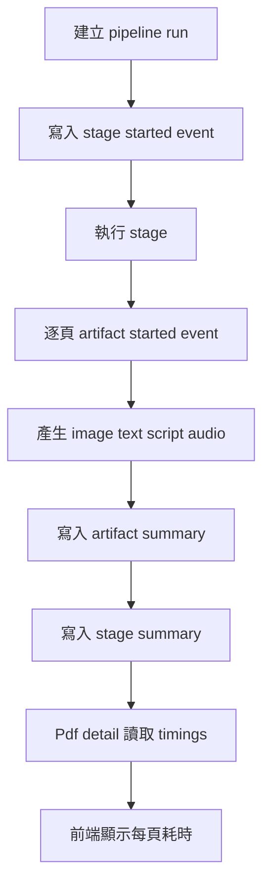

# Pipeline 階段事件標準化與 page-level artifact timing 設計

> 目的：為 [`PendingTask.md`](../PendingTask.md) 第 2 項「Pipeline 階段事件標準化與 SLA 追蹤」定義可落地的資料模型、命名規範、API 回傳與前端顯示策略。  
> 範圍：本文件只做設計，不修改程式碼；後續實作需再依此拆分 migration、worker instrumentation、API 與前端變更。

## 1. 目標與非目標

### 1.1 目標

- 標準化 pipeline 大階段事件，讓每次匯入、resume、retry 或 regenerate 都能追蹤開始、成功、失敗、略過與耗時。
- 在 PDF 詳情中提供每頁 artifact timing，讓每一頁可以顯示圖片、文字、講稿、語音各自於「當次產生或重新產生」耗費多久。
- 同時納入 script timing，避免只追蹤 image/text/audio 而缺少講稿生成成本與瓶頸。
- 支援 SLA 判定，能回答「哪個大階段超過預期」、「哪一頁哪個 artifact 超時」、「整體 pipeline 是否違反 SLA」。
- 保留歷程，讓後續可做可觀測性儀表、重生追蹤、resume 除錯與成本分析。
- 維持現有 [`PdfDetailPage`](../backend/src/types.ts:107) 向後相容，新增 `timings` 屬性但不破壞既有欄位。

### 1.2 非目標

- 不在本設計中實作分散式 queue、跨 worker tracing backend 或外部 APM。
- 不以此取代現有 `progress_step/progress_current/progress_total`；它們仍可作為目前 UI 進度顯示的簡化狀態。
- 不要求追蹤 LLM token、TTS 字元、API 成本細節；本設計保留 metadata 欄位供後續擴充。
- 不要求在第一版提供完整後台儀表板；第一版以 PDF 詳情 API 與播放頁/詳情頁顯示為主。
- 不要求回填舊資料的真實歷史耗時；migration 只能安全建立新表與空資料。

## 2. 現況問題

目前資料庫 schema 在 [`backend/src/db.ts`](../backend/src/db.ts:30) 中以 `pdfs` 與 `pages` 為核心：

- `pdfs` 只有 `progress_step`、`progress_current`、`progress_total` 可表達目前進度，但沒有每個階段的開始/結束時間、狀態、錯誤、attempt 或 SLA 結果。
- `pages` 只有 `image_path`、`text_path`、`script_path`、`audio_path`、`audio_duration_seconds`、`status`、`error_message`、`created_at`、`updated_at`，只能知道目前 artifact 是否存在，無法知道每個 artifact 產生花多久。
- [`PdfDetailPage`](../backend/src/types.ts:107) 未回傳 timings，前端無法在每頁呈現圖片、文字、講稿、語音耗時。
- 詳情 API 由 [`rowToDetail()`](../backend/src/routes/pdfs/shared.ts:383) 組裝每頁資料，目前只從 `pages` 轉出 URL、音訊長度與狀態，沒有查詢 timing summary 或 event log。
- regenerate 與 resume 的語意沒有持久化到每個 artifact timing，因此使用者無法分辨目前頁面耗時是首次 pipeline、單頁重生、批次重生或 server resume 後產生。

## 3. 設計原則

1. **事件不可變、摘要可覆寫**：完整歷程用 event log 保存；API 常用資料用 summary table 查詢，避免詳情頁每次掃大量 events。
2. **run 是一次可追蹤處理上下文**：首次 pipeline、resume、retry、batch regenerate、single artifact regenerate 都應有可關聯的 `run_id`。
3. **attempt 表達同一 run 內的重試次數**：相同 `run_id + stage/artifact + page_number` 可有多個 attempt，但 summary 只指向最新或有效 attempt。
4. **page artifact timing 是一級資料**：不要只把每頁耗時塞在 stage metadata；需要獨立查詢與前端顯示。
5. **命名穩定且低基數**：stage/artifact 名稱採固定 enum，不放 page number、模型名稱、prompt 片段等高基數內容。
6. **舊資料安全相容**：沒有 timing 的舊 PDF 回傳 `timings: null` 或 artifact 欄位為 `null`，前端顯示「尚無紀錄」。

## 4. 資料模型設計

### 4.1 採用混合策略

建議採 **event log + summary table 混合策略**：

- `pipeline_runs`：記錄一次處理上下文，包含 run type、狀態與整體耗時。
- `pipeline_stage_events`：append-only event log，保存 stage lifecycle 與診斷資訊。
- `pipeline_stage_summaries`：每個 run/stage 的目前摘要，用於列表、詳情與 SLA 查詢。
- `page_artifact_events`：append-only event log，保存每頁每個 artifact 的開始、結束、失敗、略過、重新產生歷程。
- `page_artifact_timings`：每頁每 artifact 的目前有效 timing summary，用於 [`rowToDetail()`](../backend/src/routes/pdfs/shared.ts:383) 快速組裝 API。

混合策略理由：

- 單純 event log 保真度高，但 API 查詢需聚合多筆事件，容易拖慢詳情頁。
- 單純 summary table 查詢快，但失去 resume/regenerate/failed attempt 的除錯與 SLA 歷程。
- 混合策略可讓 worker 寫入事件後同步 upsert summary，兼顧可觀測性與 UI 效能。

### 4.2 `pipeline_runs`

建議欄位：

| 欄位 | 型別 | 說明 |
| --- | --- | --- |
| `id` | TEXT PRIMARY KEY | `run_id`，建議使用 nanoid/uuid。 |
| `pdf_id` | TEXT NOT NULL | 關聯 `pdfs.id`，刪除 PDF 時 cascade。 |
| `run_type` | TEXT NOT NULL | `initial`、`retry`、`resume`、`regenerate_batch`、`regenerate_page`、`regenerate_artifact`。 |
| `parent_run_id` | TEXT NULL | resume/regenerate 可指向來源 run，方便串歷程。 |
| `triggered_by` | TEXT NOT NULL | `system`、`user`、`startup_recovery`、`api_retry`。 |
| `status` | TEXT NOT NULL | `running`、`succeeded`、`failed`、`canceled`、`partial`。 |
| `attempt` | INTEGER NOT NULL | 同一 PDF 同一 run type 的遞增嘗試序號，從 1 開始。 |
| `started_at` | TEXT NOT NULL | ISO timestamp。 |
| `ended_at` | TEXT NULL | ISO timestamp。 |
| `duration_ms` | INTEGER NULL | `ended_at - started_at`，以 monotonic timer 實測後寫入更佳。 |
| `sla_status` | TEXT NULL | `met`、`warning`、`breached`、`unknown`。 |
| `error_code` | TEXT NULL | 可對應錯誤碼字典。 |
| `error_message` | TEXT NULL | 人類可讀錯誤摘要。 |
| `metadata_json` | TEXT NULL | JSON，放 provider/model/queue delay 等低頻查詢資料。 |
| `created_at` | TEXT NOT NULL | 建立時間。 |
| `updated_at` | TEXT NOT NULL | 更新時間。 |

建議 index：

- `(pdf_id, started_at DESC)`：查 PDF 歷程。
- `(status, started_at DESC)`：查 running/failed runs。

### 4.3 `pipeline_stage_events`

建議欄位：

| 欄位 | 型別 | 說明 |
| --- | --- | --- |
| `id` | INTEGER PRIMARY KEY AUTOINCREMENT | 事件序號。 |
| `run_id` | TEXT NOT NULL | 關聯 `pipeline_runs.id`。 |
| `pdf_id` | TEXT NOT NULL | 冗餘欄位，利於查詢與除錯。 |
| `stage` | TEXT NOT NULL | 標準化 stage 名稱，見第 5 節。 |
| `event_type` | TEXT NOT NULL | `started`、`succeeded`、`failed`、`skipped`、`canceled`、`resumed`。 |
| `attempt` | INTEGER NOT NULL | 該 run 中此 stage 的 attempt。 |
| `occurred_at` | TEXT NOT NULL | 事件時間。 |
| `duration_ms` | INTEGER NULL | 結束類事件才填。 |
| `sla_status` | TEXT NULL | 結束類事件判定結果。 |
| `error_code` | TEXT NULL | 失敗時填。 |
| `error_message` | TEXT NULL | 失敗時填。 |
| `metadata_json` | TEXT NULL | page count、model、provider、input size 等。 |

建議 index：

- `(run_id, stage, attempt, occurred_at)`。
- `(pdf_id, occurred_at DESC)`。

### 4.4 `pipeline_stage_summaries`

建議欄位：

| 欄位 | 型別 | 說明 |
| --- | --- | --- |
| `run_id` | TEXT NOT NULL | 關聯 run。 |
| `pdf_id` | TEXT NOT NULL | 關聯 PDF。 |
| `stage` | TEXT NOT NULL | stage enum。 |
| `attempt` | INTEGER NOT NULL | summary 對應的有效 attempt。 |
| `status` | TEXT NOT NULL | `running`、`succeeded`、`failed`、`skipped`、`canceled`。 |
| `started_at` | TEXT NULL | stage 開始時間。 |
| `ended_at` | TEXT NULL | stage 結束時間。 |
| `duration_ms` | INTEGER NULL | 耗時。 |
| `sla_target_ms` | INTEGER NULL | 判定時使用的 SLA。 |
| `sla_status` | TEXT NOT NULL DEFAULT `unknown` | `met`、`warning`、`breached`、`unknown`。 |
| `error_code` | TEXT NULL | 錯誤碼。 |
| `error_message` | TEXT NULL | 錯誤摘要。 |
| `updated_at` | TEXT NOT NULL | 更新時間。 |

主鍵建議：`(run_id, stage)`。

### 4.5 `page_artifact_events`

建議欄位：

| 欄位 | 型別 | 說明 |
| --- | --- | --- |
| `id` | INTEGER PRIMARY KEY AUTOINCREMENT | 事件序號。 |
| `run_id` | TEXT NOT NULL | 關聯 run。 |
| `pdf_id` | TEXT NOT NULL | 關聯 PDF。 |
| `page_number` | INTEGER NOT NULL | 頁碼。 |
| `artifact` | TEXT NOT NULL | `image`、`text`、`script`、`audio`，可擴充 `video_segment`。 |
| `event_type` | TEXT NOT NULL | `started`、`succeeded`、`failed`、`skipped`、`canceled`、`invalidated`。 |
| `attempt` | INTEGER NOT NULL | 同 run/page/artifact 下的 attempt。 |
| `reason` | TEXT NOT NULL | `initial`、`regenerate`、`resume`、`retry`、`dependency_changed`、`manual_edit`。 |
| `occurred_at` | TEXT NOT NULL | 事件時間。 |
| `duration_ms` | INTEGER NULL | 結束類事件才填。 |
| `sla_status` | TEXT NULL | artifact SLA 判定。 |
| `output_path` | TEXT NULL | 成功後對應 artifact path。 |
| `error_code` | TEXT NULL | 失敗時填。 |
| `error_message` | TEXT NULL | 失敗時填。 |
| `metadata_json` | TEXT NULL | provider/model/input chars/audio duration 等。 |

建議 index：

- `(pdf_id, page_number, artifact, occurred_at DESC)`：查單頁歷程。
- `(run_id, page_number, artifact, attempt)`：查 run 內事件。

### 4.6 `page_artifact_timings`

建議欄位：

| 欄位 | 型別 | 說明 |
| --- | --- | --- |
| `pdf_id` | TEXT NOT NULL | 關聯 PDF。 |
| `page_number` | INTEGER NOT NULL | 頁碼。 |
| `artifact` | TEXT NOT NULL | `image`、`text`、`script`、`audio`。 |
| `run_id` | TEXT NOT NULL | 目前有效 timing 來自哪個 run。 |
| `attempt` | INTEGER NOT NULL | 目前有效 timing 的 attempt。 |
| `reason` | TEXT NOT NULL | 產生原因。 |
| `status` | TEXT NOT NULL | `running`、`succeeded`、`failed`、`skipped`、`canceled`、`unknown`。 |
| `started_at` | TEXT NULL | 開始時間。 |
| `ended_at` | TEXT NULL | 結束時間。 |
| `duration_ms` | INTEGER NULL | 耗時。 |
| `sla_target_ms` | INTEGER NULL | artifact SLA 目標。 |
| `sla_status` | TEXT NOT NULL DEFAULT `unknown` | SLA 結果。 |
| `output_path` | TEXT NULL | 對應 artifact path。 |
| `error_code` | TEXT NULL | 錯誤碼。 |
| `error_message` | TEXT NULL | 錯誤摘要。 |
| `updated_at` | TEXT NOT NULL | 更新時間。 |

主鍵建議：`(pdf_id, page_number, artifact)`。

此表代表「目前頁面上顯示的 artifact 是哪一次產生的」，因此 regenerate 成功後會覆寫對應 artifact summary，但舊事件仍保留在 `page_artifact_events`。

## 5. stage 與 artifact 命名規範

### 5.1 命名原則

- 使用小寫 snake_case。
- 名稱必須是固定 enum，避免動態內容造成難以聚合。
- stage 描述 pipeline 大階段；artifact 描述頁面產物種類。
- UI 可以做 i18n 對照，但 DB/API 一律使用穩定英文 key。

### 5.2 建議 stage enum

| stage | 說明 | 對應現況 progress |
| --- | --- | --- |
| `queue_wait` | 進入 queue 到 worker 實際開始前的等待時間 | 無，新增觀測用。 |
| `source_prepare` | 來源檔寫入、字幕擷取或文字匯入前處理 | 部分無對應。 |
| `render_pages` | PDF 或文字來源轉成頁面圖片 | `rendering`。 |
| `extract_text` | PDF 抽文字或讀取每頁文字 | `extracting_text`、`text_extracted`。 |
| `extract_figures` | PDF 內嵌圖表萃取（非文字/YouTube 匯入），失敗不中斷 pipeline | 無明確 progress。 |
| `split_text` | 文字/YouTube 來源切頁或大綱轉頁 | 部分無對應。 |
| `generate_scripts` | 逐頁講稿生成 | `scripting`、`script_ready`。 |
| `synthesize_audio` | 逐頁語音合成 | `synthesizing`。 |
| `generate_title` | 標題生成 | 無明確 progress。 |
| `generate_video` | 手動影片生成 | `rendering_video`。 |
| `finalize` | 寫 metadata、ready 狀態與收尾 | 無明確 progress。 |

備註：現有 [`ProgressStep`](../backend/src/types.ts:28) 可暫時維持不變，後續可用 mapping 從 stage summary 派生。

### 5.3 建議 artifact enum

| artifact | 說明 |
| --- | --- |
| `image` | 每頁圖片，例如 PDF render 或 text-to-slide image。 |
| `text` | 每頁文字內容或 OCR/抽文字結果。 |
| `script` | 每頁講稿文字。 |
| `audio` | 每頁語音檔與音訊長度。 |

未來可擴充：

- `thumbnail`：若封面/縮圖改成逐頁產物。
- `video_segment`：若影片生成改成逐頁片段。
- `captions`：若逐頁字幕檔成為正式 artifact。

## 6. `run_id`、`attempt`、`regenerate`、`resume` 語意

### 6.1 `run_id`

`run_id` 代表一次可追蹤的處理上下文，而不是一個 PDF 的永久生命週期 id。

建議建立新 `run_id` 的情境：

- 使用者完成上傳並開始首次 pipeline：`run_type = initial`。
- 使用者在 failed 後重試整份 PDF：`run_type = retry`。
- Server 啟動後恢復尚未完成的 PDF：`run_type = resume`。
- 使用者批次重新生成 script/audio/image：`run_type = regenerate_batch`。
- 使用者重新生成單頁多個 artifact：`run_type = regenerate_page`。
- 使用者只重新生成單一 artifact，例如單頁 image 或 audio：`run_type = regenerate_artifact`。
- 使用者手動生成影片：可建立 `run_type = generate_video` 或使用 `regenerate_artifact` 搭配 artifact `video_segment`，第一版建議獨立 `generate_video` stage 即可。

### 6.2 `attempt`

`attempt` 是同一個 run 中同一 stage 或 page artifact 的嘗試序號：

- 同一 `run_id + stage` 第一次執行為 attempt 1；若 worker 在同一 run 中重試該 stage，遞增為 2。
- 同一 `run_id + page_number + artifact` 第一次執行為 attempt 1；若同 run 中重試該 artifact，遞增。
- 新的 regenerate 或 resume 應建立新 run，attempt 從 1 開始，不沿用舊 run 的 attempt。

### 6.3 regenerate

Regenerate 表示使用者明確要求替換既有 artifact：

- 成功後 `page_artifact_timings` 覆寫該頁該 artifact 的有效 summary。
- 舊 summary 不再代表目前 artifact，但舊事件留在 `page_artifact_events`。
- 如果 regenerate 失敗：
  - 若保留舊 artifact，`page_artifact_timings` 應可選擇維持舊成功 summary，並另以 event log 記錄失敗。
  - 若 UI 需要顯示最近一次 regenerate 失敗，可在 summary 增加 `last_failed_run_id` 或由 API 額外帶 `latest_attempt`。第一版建議保守維持目前有效 artifact summary，失敗狀態由頁面 `error_message` 或 regenerate status 顯示。

### 6.4 resume

Resume 表示系統在中斷後接續未完成工作：

- 建議建立新的 `run_id`，`run_type = resume`，`parent_run_id` 指向被接續的 running/failed run。
- 對於已存在且確認有效的 artifact，寫入 `skipped` event，`reason = resume`，summary 可維持原本成功 timing。
- 對於需要補產生的 artifact，正常寫 `started/succeeded/failed`，`reason = resume`。
- Stage summary 應能反映 resume run 本身耗時，而不是與 parent run 合併；若需要總歷程耗時，可由 API 聚合 parent chain。

## 7. SLA 判定方式

### 7.1 SLA 設定來源

第一版建議以程式內常數或設定檔定義 SLA，避免一開始引入管理 UI：

```ts
const SLA_TARGETS_MS = {
  stages: {
    queue_wait: 30_000,
    render_pages: 120_000,
    extract_text: 120_000,
    extract_figures: 120_000,
    generate_scripts: 300_000,
    synthesize_audio: 300_000,
    generate_title: 60_000,
    generate_video: 600_000,
    finalize: 30_000,
  },
  artifacts: {
    image: 30_000,
    text: 10_000,
    script: 60_000,
    audio: 60_000,
  },
};
```

後續可擴充為依 `source_type`、page count、provider、model 或環境設定調整。

### 7.2 SLA 狀態

建議 enum：

- `met`：`duration_ms <= sla_target_ms`。
- `warning`：超過目標但未達 breach 倍率，例如 `duration_ms <= sla_target_ms * 1.5`。
- `breached`：超過 warning 門檻。
- `unknown`：缺少 `duration_ms`、缺少 target、仍在 running 或舊資料。

### 7.3 判定時機

- stage 或 artifact 寫入 `succeeded/failed/skipped/canceled` 結束事件時判定。
- `running` 中可以由 API 或前端以目前時間動態估算「可能超時」，但不寫入正式 `sla_status`，避免 worker 未結束就產生誤判。
- `skipped` 預設 `unknown` 或 `met` 皆可；建議第一版使用 `unknown`，因為 skipped 沒有實際產生耗時。

### 7.4 整體 SLA

PDF/run 層級 SLA 可由 `pipeline_runs.duration_ms` 與 `pipeline_runs.sla_status` 表示：

- `breached` 優先：任一必要 stage 或必要 artifact breached，整體可標示 breached。
- `warning` 次之：沒有 breached 但有 warning。
- `met`：所有必要項目皆 met。
- `unknown`：仍在 running 或缺資料。

## 8. API 回傳格式

### 8.1 `PdfDetailPage.timings`

在 [`PdfDetailPage`](../backend/src/types.ts:107) 新增可選欄位：

```ts
export interface PdfDetailPageTimingItem {
  artifact: 'image' | 'text' | 'script' | 'audio';
  status: 'running' | 'succeeded' | 'failed' | 'skipped' | 'canceled' | 'unknown';
  duration_ms: number | null;
  started_at: string | null;
  ended_at: string | null;
  sla_target_ms: number | null;
  sla_status: 'met' | 'warning' | 'breached' | 'unknown';
  run_id: string | null;
  attempt: number | null;
  reason: 'initial' | 'regenerate' | 'resume' | 'retry' | 'dependency_changed' | 'manual_edit' | null;
  error_code?: string | null;
  error_message?: string | null;
}

export interface PdfDetailPageTimings {
  image: PdfDetailPageTimingItem | null;
  text: PdfDetailPageTimingItem | null;
  script: PdfDetailPageTimingItem | null;
  audio: PdfDetailPageTimingItem | null;
}

export interface PdfDetailPage {
  page_number: number;
  image_url: string | null;
  text_url: string | null;
  script_url: string | null;
  audio_url: string | null;
  audio_duration_seconds: number | null;
  status: PageStatus;
  timings?: PdfDetailPageTimings | null;
}
```

第一版建議 API 一律帶 `timings`，但舊資料可為：

```json
{
  "image": null,
  "text": null,
  "script": null,
  "audio": null
}
```

### 8.2 PDF detail 範例

```json
{
  "id": "lmPpAZjSXY",
  "status": "ready",
  "pages": [
    {
      "page_number": 3,
      "image_url": "api/pdfs/lmPpAZjSXY/pages/3/image",
      "text_url": "api/pdfs/lmPpAZjSXY/pages/3/text",
      "script_url": "api/pdfs/lmPpAZjSXY/pages/3/script",
      "audio_url": "api/pdfs/lmPpAZjSXY/pages/3/audio",
      "audio_duration_seconds": 12.34,
      "status": "audio_ready",
      "timings": {
        "image": {
          "artifact": "image",
          "status": "succeeded",
          "duration_ms": 1842,
          "started_at": "2026-05-14T17:00:01.100Z",
          "ended_at": "2026-05-14T17:00:02.942Z",
          "sla_target_ms": 30000,
          "sla_status": "met",
          "run_id": "run_abc123",
          "attempt": 1,
          "reason": "initial"
        },
        "text": {
          "artifact": "text",
          "status": "succeeded",
          "duration_ms": 420,
          "started_at": "2026-05-14T17:00:03.000Z",
          "ended_at": "2026-05-14T17:00:03.420Z",
          "sla_target_ms": 10000,
          "sla_status": "met",
          "run_id": "run_abc123",
          "attempt": 1,
          "reason": "initial"
        },
        "script": {
          "artifact": "script",
          "status": "succeeded",
          "duration_ms": 8450,
          "started_at": "2026-05-14T17:00:10.000Z",
          "ended_at": "2026-05-14T17:00:18.450Z",
          "sla_target_ms": 60000,
          "sla_status": "met",
          "run_id": "run_abc123",
          "attempt": 1,
          "reason": "initial"
        },
        "audio": {
          "artifact": "audio",
          "status": "succeeded",
          "duration_ms": 12100,
          "started_at": "2026-05-14T17:00:20.000Z",
          "ended_at": "2026-05-14T17:00:32.100Z",
          "sla_target_ms": 60000,
          "sla_status": "met",
          "run_id": "run_abc123",
          "attempt": 1,
          "reason": "initial"
        }
      }
    }
  ]
}
```

### 8.3 Pipeline stage API

可在 `PdfDetail` 額外新增可選欄位 `pipeline_runs` 或 `latest_pipeline_run`，第一版建議先只加最新 run 摘要：

```ts
export interface PdfDetailPipelineStageTiming {
  stage: string;
  status: string;
  duration_ms: number | null;
  started_at: string | null;
  ended_at: string | null;
  sla_target_ms: number | null;
  sla_status: 'met' | 'warning' | 'breached' | 'unknown';
  attempt: number;
  error_code?: string | null;
  error_message?: string | null;
}

export interface PdfDetailLatestRun {
  run_id: string;
  run_type: string;
  status: string;
  attempt: number;
  started_at: string;
  ended_at: string | null;
  duration_ms: number | null;
  sla_status: 'met' | 'warning' | 'breached' | 'unknown';
  stages: PdfDetailPipelineStageTiming[];
}
```

若擔心 API payload 過大，可先不把 stage events 全量放入 detail，只提供 latest run stage summaries，歷史事件另開 `/api/pdfs/:id/runs` 與 `/api/pdfs/:id/runs/:runId/events`。

### 8.4 `rowToDetail()` 組裝建議

後續實作時，詳情路由在查出 `pages` 後，應再查 `page_artifact_timings`：

- 以 `WHERE pdf_id = ?` 一次查出該 PDF 所有 page artifact timings。
- 在記憶體中用 key `${page_number}:${artifact}` 建 map。
- [`rowToDetail()`](../backend/src/routes/pdfs/shared.ts:383) 可新增第三個參數 `timingsByPage`，避免它自行查 DB，讓資料存取集中在 route handler。
- 舊呼叫點可先傳空 map，以保持漸進式改造。

### 8.5 Run history API（已實作）

`GET /api/pdfs/:id/runs`：

- 僅做輕量存在性檢查（`SELECT id FROM pdfs WHERE id = ?`，不存在回 404 `PDF_NOT_FOUND`），不做 `canReadPdf`／擁有權檢查，與 [`figures.ts`](../backend/src/routes/pdfs/figures.ts)、[`page-animation.ts`](../backend/src/routes/pdfs/page-animation.ts) 的既有路由一致。
- query 參數 `limit`（可選，整數 1~100，預設 20）：限制回傳的 run 數量。
- 回應依 `pipeline_runs.started_at` 由新到舊排序（再以 `id` 排序當 tie-break），每個 run 內的 `stages` 依 §5.2 的 12 個 stage 順序排序（與 `started_at` 無關，避免同時啟動的多個 stage 排序不穩定）。

```ts
export interface PipelineRunStageSummary {
  stage: PipelineStage;
  status: TimingEventStatus;
  attempt: number;
  started_at: string | null;
  ended_at: string | null;
  duration_ms: number | null;
  sla_target_ms: number | null;
  sla_status: TimingSlaStatus;
  error_code: string | null;
  error_message: string | null;
}

export interface PipelineRunSummary {
  id: string;
  run_type: PipelineRunType;
  parent_run_id: string | null;
  triggered_by: string;
  status: PipelineRunStatus;
  attempt: number;
  started_at: string;
  ended_at: string | null;
  duration_ms: number | null;
  sla_status: TimingSlaStatus;
  error_code: string | null;
  error_message: string | null;
  metadata: Record<string, unknown> | null; // 解析自 metadata_json，非物件或解析失敗時為 null
  stages: PipelineRunStageSummary[];
}

export interface PipelineRunsResponse {
  runs: PipelineRunSummary[];
}
```

前端在「系統資料」分頁切換時呼叫 `fetchPdfRunHistory(pdfId)`（[`frontend/src/lib/api/pdfs.ts`](../frontend/src/lib/api/pdfs.ts)），於「執行歷程」區塊列出每個 run（類型、第 N 次、開始時間、狀態、總耗時），可展開查看各 stage 的狀態／耗時／SLA 與失敗訊息。

### 8.6 Slow artifact ranking API（已實作）

`GET /api/pdfs/:id/slow-artifacts`：

- 與 8.5 相同的輕量存在性檢查（`SELECT id FROM pdfs WHERE id = ?`，不存在回 404 `PDF_NOT_FOUND`），不做 `canReadPdf`／擁有權檢查。
- query 參數 `limit`（可選，整數 1~20，預設 5）：限制回傳的素材數量。
- 從 `page_artifact_timings` 取出該 PDF 所有 `duration_ms IS NOT NULL` 的紀錄（每個 `(page_number, artifact)` 只保留最新一筆），依 `duration_ms` 由大到小排序（相同耗時時以 `page_number` 由小到大為 tie-break），回傳前 `limit` 筆。

```ts
export interface SlowArtifactSummary {
  page_number: number;
  artifact: PageArtifact;
  status: TimingEventStatus;
  duration_ms: number | null;
  sla_target_ms: number | null;
  sla_status: TimingSlaStatus;
  updated_at: string;
}

export interface SlowArtifactsResponse {
  artifacts: SlowArtifactSummary[];
}
```

前端在「系統資料」分頁切換時呼叫 `fetchPdfSlowArtifacts(pdfId)`（[`frontend/src/lib/api/pdfs.ts`](../frontend/src/lib/api/pdfs.ts)），於「🐢 最慢素材排行」區塊以表格列出第 N 頁／素材類型（圖片／文字／講稿／語音）／狀態／耗時／SLA，協助找出最慢的頁面與素材，呼應 §9.3 提到的「最慢的前幾個 page artifact，例如『第 5 頁語音 75s』」需求。

## 9. 前端顯示策略

### 9.1 每頁顯示

在播放頁或頁面詳情區塊中，為每頁呈現一組 compact timing chips：

- `圖片 1.8s`、`文字 0.4s`、`講稿 8.5s`、`語音 12.1s`。
- SLA `met` 使用中性或成功色；`warning` 使用黃/橘；`breached` 使用紅；`unknown` 使用灰色。
- 若 timing 為 `null`，顯示 `圖片 --` 或 tooltip「尚無 timing 紀錄」。
- 若 artifact 正在 running，顯示 spinner 或 `產生中`，可動態顯示 elapsed time 但不取代後端最終 `duration_ms`。

### 9.2 Tooltip / 詳細資訊

滑鼠 hover 或展開時顯示：

- 產生原因：首次產生、重新產生、resume、retry。
- `started_at` / `ended_at`。
- SLA 目標與結果。
- `run_id` 短碼與 attempt。
- 失敗時顯示 `error_code` 與 `error_message`。

### 9.3 PDF 整體顯示

首頁列表可暫不新增欄位，避免 payload 增加；PDF 詳情可顯示最新 run：

- 總耗時。
- 各 stage 耗時條或簡單列表。
- SLA 總狀態。
- 最慢的前幾個 page artifact，例如「第 5 頁語音 75s」。

### 9.4 Mermaid 流程圖



## 10. 實作步驟

1. 新增 timing 型別定義：在 [`backend/src/types.ts`](../backend/src/types.ts:107) 增加 stage/artifact enum、timing item 與 `PdfDetailPage.timings`。
2. 新增 migration：在 [`backend/src/db.ts`](../backend/src/db.ts:30) 建立 `pipeline_runs`、`pipeline_stage_events`、`pipeline_stage_summaries`、`page_artifact_events`、`page_artifact_timings` 與 index。
3. 建立 timing repository/service：封裝 `startRun`、`finishRun`、`startStage`、`finishStage`、`startArtifact`、`finishArtifact`、`failArtifact`、`skipArtifact`，避免 worker 到處手寫 SQL。
4. 在 worker pipeline instrumentation：於 [`runPipeline()`](../backend/src/worker/pipeline.ts:366) 與各 step 周邊寫入 stage events/summaries。
5. 在逐頁 artifact 產生處加入 instrumentation：image、text、script、audio 分別寫入 `page_artifact_events` 與 `page_artifact_timings`。
6. 在 regenerate flow 加入 run 與 artifact timing：單頁 image/audio/script rewrite、批次 regenerate 都要帶 `reason = regenerate`。
7. 在 resume/recovery flow 加入 run 語意：server startup recovery 建立 `run_type = resume`，已存在 artifact 以 skipped 或保留原 summary 處理。
8. 更新詳情 API 查詢：在 detail route 查 `page_artifact_timings`，交給 [`rowToDetail()`](../backend/src/routes/pdfs/shared.ts:383) 組出 `PdfDetailPage.timings`。
9. 更新前端型別：在 [`frontend/src/types.ts`](../frontend/src/types.ts) 增加 timings 欄位。
10. 更新前端顯示：在播放/詳情頁呈現每頁 artifact timing chips 與 SLA 狀態。
11. 保留 `progress_step/progress_current/progress_total`：第一版不移除，必要時從既有邏輯繼續更新。
12. 補測試：DB migration、timing service、detail API、regenerate/resume 情境與前端 rendering。

## 11. 測試計畫

### 11.1 單元測試

- SLA 判定函式：`met`、`warning`、`breached`、`unknown` 邊界。
- timing service：start/finish/fail/skip 寫入 event log 並 upsert summary。
- attempt 遞增：同 run 同 artifact 重試時 attempt 正確增加。
- enum validation：未知 stage/artifact 不應寫入或應被 zod/型別擋下。

### 11.2 整合測試

- 初次 pipeline 完成後，每頁都有 `image/text/script/audio` timing summary。
- PDF detail API 回傳 `pages[n].timings` 且舊欄位仍存在。
- 單頁 regenerate image 後，該頁 `timings.image.run_id/reason/duration_ms` 更新，其他 artifact timing 不被覆寫。
- regenerate audio 後，`audio_duration_seconds` 與 `timings.audio` 同步合理。
- stage summaries 能反映 pipeline 大階段成功與耗時。
- migration 在既有 DB 上執行不破壞舊資料，舊 PDF detail timings 為 null/unknown。

### 11.3 失敗與 resume 測試

- 模擬 script generation 失敗：寫入 failed event、summary status failed、error_code/error_message。
- 模擬 worker 中斷後 resume：新建 resume run，已完成 artifact 不重寫成功 timing，未完成 artifact 正常補 timing。
- 同一 artifact 在同 run 中 retry：event log 保留多個 attempt，summary 指向最新有效 attempt。

### 11.4 前端測試

- `timings = null` 或各 artifact 為 null 時不 crash，顯示 fallback。
- `sla_status = warning/breached` 時樣式正確。
- running artifact 顯示產生中狀態。
- tooltip 顯示 reason、attempt、SLA 與錯誤資訊。

## 12. 相容性與 migration 策略

### 12.1 DB migration

- 只新增表與 index，不修改既有 `pdfs`、`pages` 欄位。
- 所有新表以 `CREATE TABLE IF NOT EXISTS` 建立。
- 使用 `FOREIGN KEY ... ON DELETE CASCADE` 連到 `pdfs(id)` 與 `pipeline_runs(id)`，確保刪除 PDF 時清掉 timing 資料。
- 舊資料不回填虛構耗時；若需要可選擇以 `created_at/updated_at` 產生粗略 timing，但第一版不建議，避免誤導 SLA。

### 12.2 API 相容

- [`PdfDetailPage`](../backend/src/types.ts:107) 只新增 optional `timings`，不移除既有欄位。
- 舊 PDF 回傳 `timings` 為 null object 或 artifact null，前端需能處理。
- 若前端尚未更新，新增欄位不會破壞既有 JSON client。

### 12.3 Worker 相容

- timing 寫入失敗不應讓核心 pipeline 失敗；第一版可在 timing service 中記錄 logger error，但不要 throw 到主流程，除非 DB 已整體不可用。
- 若部分 stage 尚未 instrumentation，summary 缺資料時 SLA 為 `unknown`。
- 保留現有 `progress_step/progress_current/progress_total` 更新路徑，直到 UI 完全遷移到 stage summary。

### 12.4 前端相容

- 新 UI 使用 feature detection：`if page.timings?.audio`。
- 未有 timing 的 PDF 顯示「尚無紀錄」，不要顯示 0s，避免與真實零耗時混淆。
- 首頁列表不必立即顯示 timings，避免尚未調整 pagination/payload 時造成負擔。

## 13. 後續可擴充方向

- ~~新增 run history API，讓使用者查看每次 regenerate/resume 的完整歷程~~（已新增 `GET /api/pdfs/:id/runs`，回傳該 PDF 所有 `pipeline_runs`（依 `started_at` 由新到舊排序，預設上限 20、可用 `limit` 查詢參數調整，上限 100）及每個 run 對應的 `pipeline_stage_summaries`（依§5.2 的 stage 順序排序），詳見 §8.5；前端於「系統資料」分頁新增「執行歷程」區塊，可展開查看各 run 的階段耗時與 SLA；分支 `feature/pipeline-run-history-20260616`）。
- 將 SLA target 移到設定檔或 DB，支援不同 provider/model/source_type。
- 將 timing event 與 token/成本統計關聯，支援成本儀表。
- ~~建立 slow artifact ranking，協助找出最慢頁面與最慢階段~~（已新增 `GET /api/pdfs/:id/slow-artifacts`，回傳該 PDF 的 `page_artifact_timings` 依 `duration_ms` 由大到小排序的前幾筆（預設 5、可用 `limit` 調整，上限 20），詳見 §8.6；前端於「系統資料」分頁新增「🐢 最慢素材排行」表格；分支 `feature/pipeline-slow-artifact-ranking-20260616`）。
- 若導入分散式 queue，可把 `run_id` 作為 trace correlation id，串接 worker logs。
