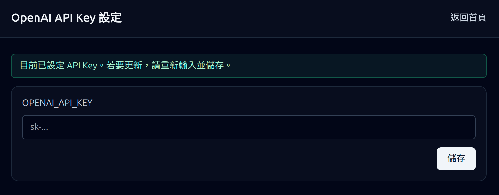

# OpenAI 金鑰設定 / Setup OpenAI Key

我們可以在這裡設定 API 金鑰，這是產生投影片圖片、文字與音訊所必需的。  
You can configure the API key here, which is required to generate slide images, text, and audio.

# 文件列表 / Document List

我們可以上傳 PDF、純文字，或 YouTube 連結作為投影片內容來源。  
You can upload PDF files, plain text, or YouTube links as the content source for slides.

makeslide 會解析上傳資料並切分成多張投影片。每張投影片包含：  
makeslide parses the uploaded content and splits it into slides. Each slide includes:

* 一張圖片 / One image
* 文字提示（prompt）/ A text prompt
* 用於語音解說的 TTS 文字 / TTS text used to explain the image
* 由文字生成的音訊 / Audio generated from the text

不同的輸入來源會使用不同方式來產生這些內容。  
Different input sources use different methods to generate these contents.

# PDF

系統會將 PDF 每一頁完整擷取為圖片，接著從圖片擷取文字作為該頁的提示詞。  
The system extracts each full PDF page as an image, then extracts text from the image as the prompt for that page.

TTS 文字會由 LLM 生成。我們會把圖片、提示詞與目前的 TTS 文字一起送給 LLM，產生更適合的 TTS 文字。  
TTS text is generated by an LLM. We send the image, prompt, and current TTS text to the LLM to produce better TTS text.

此外，我們也會提供前一頁與下一頁的 TTS 文字，協助 LLM 生成更連貫的內容。  
In addition, we provide the previous and next page TTS text to help the LLM generate more coherent narration.

# 文字 / Text

如果上傳的是文字內容，系統會將其切分成多頁。每頁需以 `Slide XXX` 開頭。系統會以該段文字作為提示詞，並為每頁生成圖片。  
If plain text is uploaded, it is split into multiple pages. Each page should start with `Slide XXX`. The text is used as the prompt to generate an image for each page.

接著，系統會以與 PDF 相同的流程產生 TTS 文字與音訊。  
Then, the system generates TTS text and audio using the same process as PDF input.

# YouTube

如果上傳的是 YouTube 連結，系統會擷取字幕，並使用 LLM 為每頁生成提示詞。接著，會像文字上傳一樣為每頁生成圖片。  
If a YouTube link is uploaded, the system fetches captions and uses an LLM to generate prompts for each page. Then it generates images in the same way as text upload.

最後，系統會使用提示詞與圖片來生成 TTS 文字與音訊。  
Finally, the system uses the prompt and image to generate TTS text and audio.
