# makeslide 整體功能介紹 / Overview

makeslide 是一套把「內容」快速轉成「可播放簡報」的工具。你可以上傳 PDF、純文字或 YouTube 連結，系統會自動切分成多頁投影片，並為每頁生成圖片、提示詞、逐字稿與語音。

makeslide is a tool that quickly turns content into a playable presentation. You can upload PDF files, plain text, or YouTube links, and the system automatically splits them into slides, then generates images, prompts, narration scripts, and audio for each slide.

除了自動生成，makeslide 也提供完整編輯流程：你可以逐頁修改圖片、提示詞、逐字稿與語音設定，並用播放器即時預覽與全螢幕播放。簡報過程中還可啟用即時投票功能，收集聽眾回饋。

In addition to auto-generation, makeslide provides a full editing workflow: you can edit images, prompts, scripts, and voice settings page by page, then preview in the player and present in full-screen mode. You can also enable realtime polls during presentation to collect audience feedback.

# OpenAI 金鑰設定 / Setup OpenAI Key

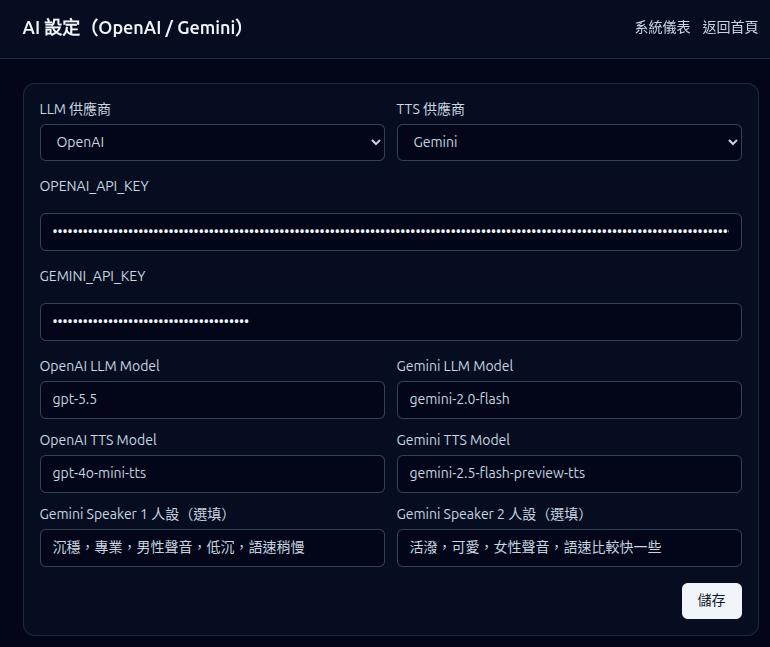

在系統設定頁中，可以設定 AI 相關參數，包含 API 金鑰、LLM/TTS 供應商與模型。這些設定會影響圖片生成、逐字稿生成與語音合成。  
In the system settings page, you can configure AI-related parameters, including API keys, LLM/TTS providers, and models. These settings affect image generation, script generation, and speech synthesis.

目前支援：  
Currently supported:

* OpenAI API Key
* Gemini API Key
* LLM Provider（OpenAI 或 Gemini）/ LLM Provider (OpenAI or Gemini)
* TTS Provider（OpenAI 或 Gemini）/ TTS Provider (OpenAI or Gemini)
* OpenAI / Gemini 的 LLM 模型選擇
* OpenAI / Gemini 的 TTS 模型選擇
* Gemini TTS 雙講者人設（Speaker 1 / Speaker 2 persona）

補充：如果只設定其中一個供應商，請確認 LLM/TTS Provider 也切換到相同供應商，避免執行時因缺少對應金鑰而失敗。  
Note: If only one provider key is configured, make sure LLM/TTS Provider is switched to the same provider to avoid runtime failures due to missing keys.

語言設定（新增）：  
Language settings (new):

* 介面語言（UI Language）：可切換繁體中文 / English
* 生成語言（Output Language）：控制圖片描述、逐字稿與語音內容主要語言

你可以用中文介面產生英文內容，或反過來使用英文介面產生中文內容。  
You can use a Chinese UI to generate English output, or an English UI to generate Chinese output.

# 文件列表 / Document List

我們可以上傳 PDF、純文字，或 YouTube 連結作為投影片內容來源。  
You can upload PDF files, plain text, or YouTube links as the content source for slides.

makeslide 會解析上傳資料並切分成多張投影片。每張投影片包含：  
makeslide parses the uploaded content and splits it into slides. Each slide includes:

* 一張圖片 / One image
* 文字提示（prompt）/ A text prompt
* 用於語音解說的 TTS 文字 / TTS text used to explain the image
* 由文字生成的音訊 / Audio generated from the text

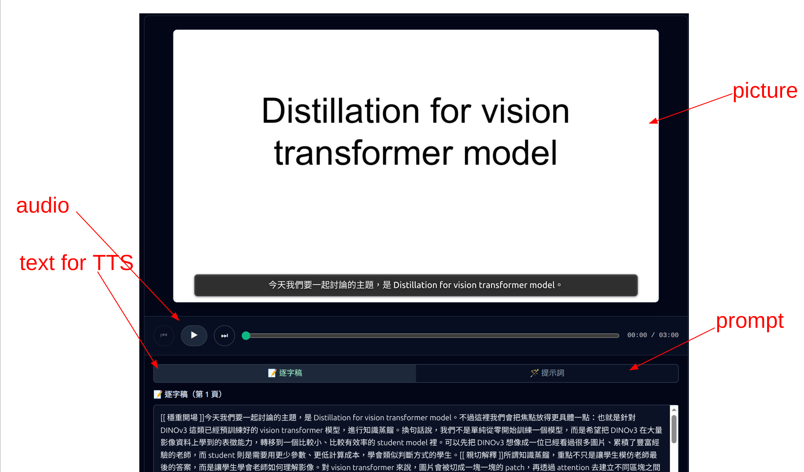

不同的輸入來源會使用不同方式來產生這些內容。  
Different input sources use different methods to generate these contents.

# PDF

系統會將 PDF 每一頁完整擷取為圖片，接著從圖片擷取文字作為該頁的提示詞。  
The system extracts each full PDF page as an image, then extracts text from the image as the prompt for that page.

TTS 文字會由 LLM 生成。我們會把圖片、提示詞與目前的 TTS 文字一起送給 LLM，產生更適合的 TTS 文字。  
TTS text is generated by an LLM. We send the image, prompt, and current TTS text to the LLM to produce better TTS text.

此外，我們也會提供前一頁與下一頁的 TTS 文字，協助 LLM 生成更連貫的內容。  
In addition, we provide the previous and next page TTS text to help the LLM generate more coherent narration.

# 文字 / Text

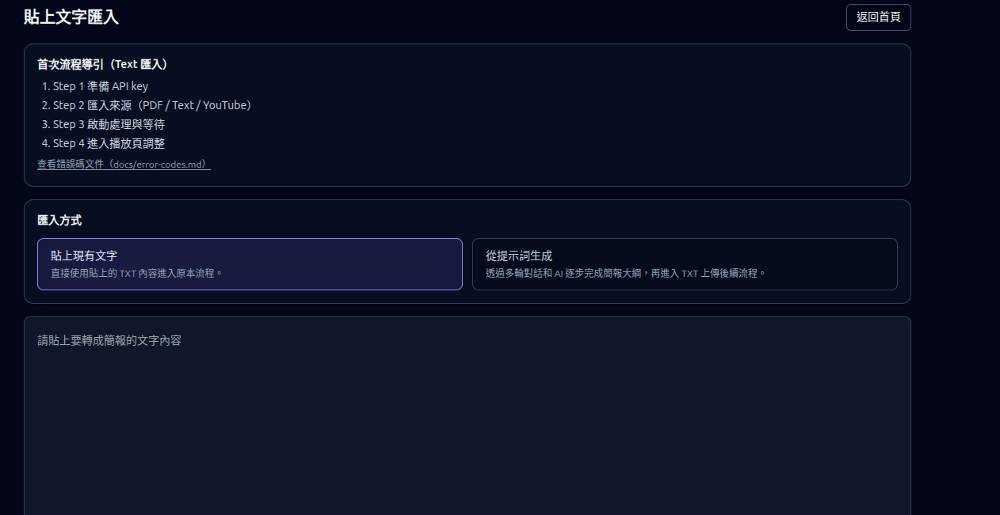

如果上傳的是文字內容，系統會將其切分成多頁。每頁需以 `Slide XXX` 開頭。系統會以該段文字作為提示詞，並為每頁生成圖片。  
If plain text is uploaded, it is split into multiple pages. Each page should start with `Slide XXX`. The text is used as the prompt to generate an image for each page.

接著，系統會以與 PDF 相同的流程產生 TTS 文字與音訊。  
Then, the system generates TTS text and audio using the same process as PDF input.

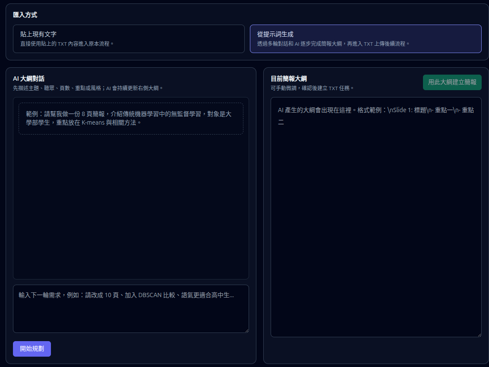

除了事先寫好的大綱外，也可以用對話的方式請語言模型產生適當的大綱。  
Besides using a pre-written outline, you can also ask the language model conversationally to generate a suitable outline.

# YouTube

如果上傳的是 YouTube 連結，系統會擷取字幕，並使用 LLM 為每頁生成提示詞。接著，會像文字上傳一樣為每頁生成圖片。  
If a YouTube link is uploaded, the system fetches captions and uses an LLM to generate prompts for each page. Then it generates images in the same way as text upload.

最後，系統會使用提示詞與圖片來生成 TTS 文字與音訊。  
Finally, the system uses the prompt and image to generate TTS text and audio.

# 類別 / Categories

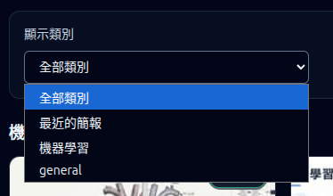

系統目前支援「顯示類別」功能，可以在文件列表中快速切換不同類別，只顯示該類別的簡報，方便在大量簡報中快速定位。  
The system now supports category display filtering. You can switch categories in the document list to show only presentations in that category, making it easier to find target decks in large collections.

常見使用方式：  
Common usage:

* 只看某一堂課、某一專案或某一主題的簡報 / View slides for only one course, project, or topic
* 隱藏不相關類別，縮小清單範圍 / Hide unrelated categories to narrow the list
* 搭配搜尋與排序更快找到目標文件 / Combine with search and sorting to find target decks faster

# 播放器 / Player

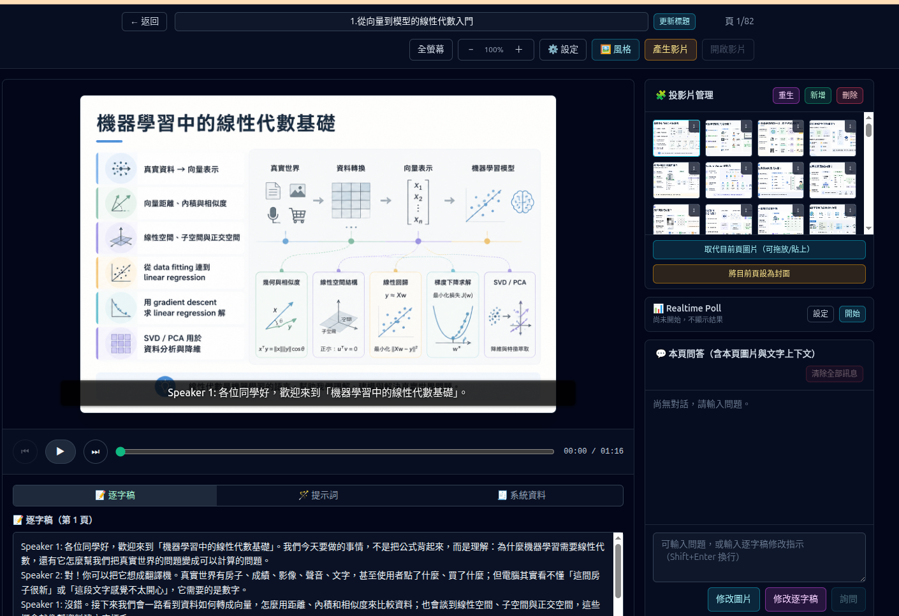

選擇任何一個簡報就可以進入播放器；如果簡報還沒有完全生成，進入播放器後會以唯讀模式顯示，待素材完成後即可編輯。  
Open any presentation to enter the player. If generation is not finished yet, the player opens in read-only mode until assets are ready.

播放器會顯示每一頁的圖片、提示詞、逐字稿與系統資料，並提供逐頁編輯能力。你可以依需求重生圖片、改寫逐字稿、重新合成語音，或直接調整文字內容。  
The player shows each slide’s image, prompt, script, and system metadata, and supports per-slide editing. You can regenerate images, rewrite scripts, resynthesize audio, or directly edit text.

此外，播放器也支援簡報同步（Sync）模式：  
In addition, the player supports presentation sync mode:

* 主控端（master）可控制頁碼、播放/暫停與播放進度 / The master controls slide index, play/pause, and playback time
* 追隨端（follower）可用顯示碼加入同一場次並同步觀看 / Followers can join with a display code and stay synchronized
* 可查看在線人數與同步狀態，適合教學或多人簡報場景 / Online count and sync status are visible, suitable for classrooms and multi-user sessions

同步模式補充（新增）：  
Sync mode updates (new):

* master 身分與同步狀態會持久化（含有效期限與心跳更新） / Master role and sync state are persisted with TTL and heartbeat
* master 重新整理頁面後可恢復角色，避免 pause 一段時間後意外掉成 follower / Master can recover after page reload, reducing accidental fallback to follower after pausing
* 既有同步場次下，其他人進入播放頁可直接加入 follower 同步流程 / Others can directly join as followers when a sync session already exists

## 選擇投影片 / Select Slides

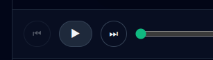

有二個方式可以選擇投影片，首先是使用撥放器上的上一頁/下一頁圖示。  
There are two ways to select slides. First, use the previous/next buttons in the player.

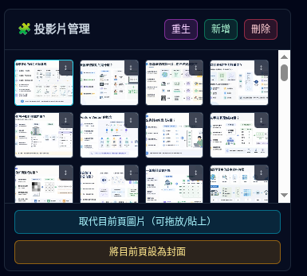

另一個方式是使用投影片管理功能直接選擇一頁。  
Second, use slide management to jump directly to a specific slide.

## 撥放簡報 / Play Presentation

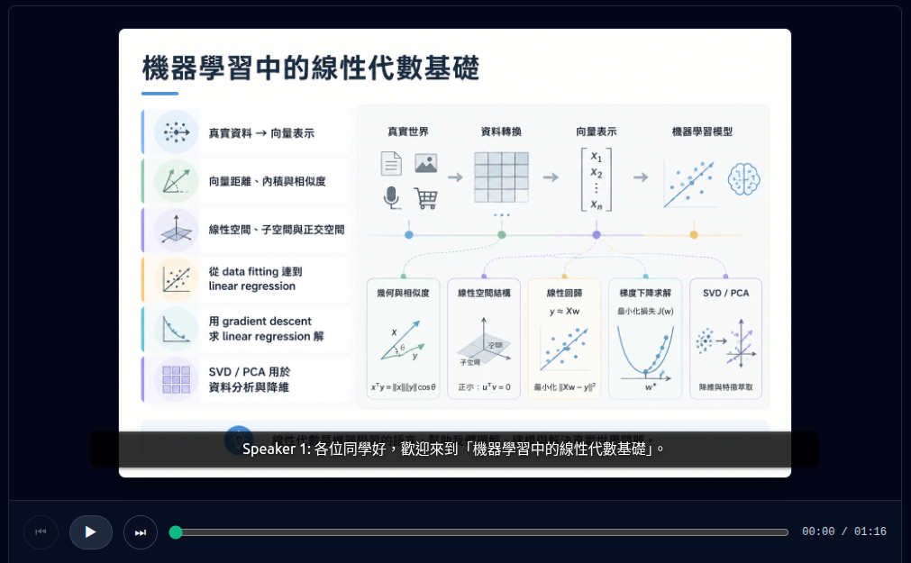

按下撥放鍵就可以開使撥放簡報，此時可以用上方的全螢幕鍵切至全螢幕模式。一張投影片撥放完成後會自動進入下一張。  
Press Play to start the presentation. You can switch to full-screen mode using the top full-screen button. After one slide finishes, it automatically moves to the next.

在全螢幕撥放模式中，我們可以使用方向鍵跳至下一頁或上一頁。按下 ESC 鍵可以離開全螢幕模式。  
In full-screen mode, you can use arrow keys to go to the next or previous slide. Press ESC to exit full-screen.

## 編緝功能 / Editing Features

makeslide 提供了很完整的編輯功能。我們可以提供一些額外的提示詞來修改目前的內容，除了目前的提示詞外，
不同的動作可能會用到一些不同的內容。  
makeslide provides comprehensive editing capabilities. You can provide additional prompts to adjust current content, and different actions may use different context inputs.

* 修改提示詞 / Edit prompts
* 修改圖片，會使用目前的圖片和提示詞及逐字稿來產生圖片。 / Regenerate images using the current image, prompt, and script
* 修改逐字稿，會使用目前頁面的圖片和提示詞產生逐字稿，上一頁和下一頁的逐字稿也會被使用，以確認逐字稿的流暢度。 / Rewrite scripts using current slide context plus neighboring scripts for coherence
* 語言，會使用逐字稿產生語言，目前設定內的資料會被使用來客製化語音的內容。我們可以透過提示詞來修改語氣。 / Language and TTS style follow settings, and tone can be adjusted with prompts

播放設定 UI：  
Playback settings UI:

* 音訊/上課模式/學生端音訊控制已整合為「播放設定狀態列」 / Audio, classroom mode, and follower-audio controls are merged into one status bar
* 狀態列右側提供「設定」按鍵，按下後才展開詳細選項 / A Settings button on the right expands detailed options
* 同步模式下 follower 預設可被要求靜音，master 可控制是否解鎖學生端自行播放 / In sync mode, followers can be muted by policy, and master can unlock local playback

音訊格式與播放體驗：  
Audio format and playback experience:

* 語音檔已採較省頻寬的 AAC（`.m4a`）格式，行動網路播放更穩定 / Audio uses bandwidth-friendly AAC (`.m4a`) for better mobile playback stability
* 手機播放時會盡量維持喚醒（Wake Lock），降低長時間播放黑屏機率 / Wake Lock is used when possible to reduce screen-off risk during long playback

## 即時投票與聽眾提問（realtime poll / Q&A）

在簡報過程中，可以啟用即時投票功能，收集聽眾想法，也可以讓追隨端直接提交問題（Q&A）。  
During presentation, you can enable realtime polls to gather audience feedback, and followers can also submit live questions (Q&A).

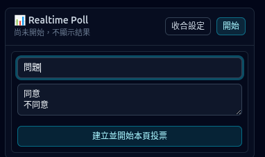

按下設定可開啟編輯器，設定投票或提問顯示方式。  
Click Settings to open the editor and configure how polls or questions are shown.

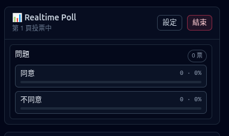

按下開始可啟動互動流程。主控端可執行以下操作：  
Click Start to begin the interaction flow. The master can:

* 顯示/隱藏聽眾問題 / Show or hide audience questions
* 挑選目前要投影的問題 / Select which question to project now
* 一鍵請 AI 根據當前頁內容與問題列表生成回答，作為現場回覆草稿 / Ask AI to generate an on-stage draft answer from current slide context and question list

這些互動狀態會與同步播放資訊一起更新，讓主講者與聽眾看到一致畫面。  
These interaction states are synchronized with playback state so presenters and audience see consistent screens.

