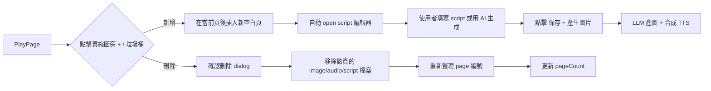
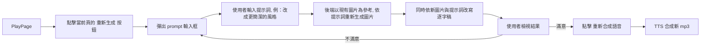
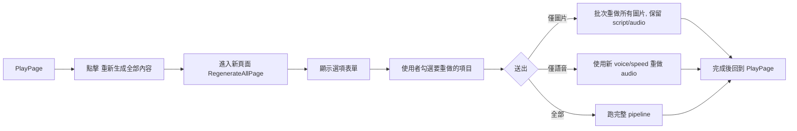
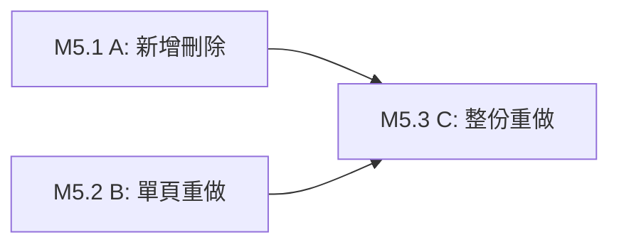

# 下一階段功能設計文件 — 投影片編輯與重新生成

> 版本：v0.1（設計草案）
> 語言：繁體中文
> 狀態：待審閱

---

## 目錄

1. [目標與範圍](#1-目標與範圍)
2. [現況分析](#2-現況分析)
3. [功能 A：新增／刪除投影片](#3-功能a新增刪除投影片)
4. [功能 B：重新產生單頁圖片與逐字稿](#4-功能b重新產生單頁圖片與逐字稿)
5. [功能 C：整份簡報重新生成頁面](#5-功能c整份簡報重新生成頁面)
6. [資料模型與檔案儲存變更](#6-資料模型與檔案儲存變更)
7. [API 設計](#7-api-設計)
8. [前端頁面與元件設計](#8-前端頁面與元件設計)
9. [LLM 提示詞設計](#9-llm-提示詞設計)
10. [邊界情況與錯誤處理](#10-邊界情況與錯誤處理)
11. [實作里程碑](#11-實作里程碑)

---

## 1. 目標與範圍

本設計文件涵蓋三個核心新功能，皆在現有 [`PlayPage`](frontend/src/pages/PlayPage.tsx) 為基礎上延伸：

| 代號 | 功能 | 主要使用者場景 |
|------|------|----------------|
| A | 新增／刪除投影片 | 使用者想在第 5 頁後插入一頁新內容；或移除不需要的第 12 頁 |
| B | 單頁「重新產生圖片＋逐字稿」 | 使用者對目前第 3 頁的圖像不滿意，希望依提示詞調整後自動同步更新 script |
| C | 全部重新生成 | 使用者想用新的風格/聲音/速度全部重做；或只重做圖片但保留音訊 |

### 1.1 設計原則

- **保留既有成果**：沿用目前的 idempotent 機制（[`synthesizeAudio()`](backend/src/worker/steps/synthesizeAudio.ts:75) 與 [`renderTextPagesWithLlm()`](backend/src/worker/steps/renderTextPagesWithLlm.ts:26) 已支援「已存在就重用」）。
- **原地編輯**：功能 A、B 皆在 `PlayPage` 上操作，不需要離開當前瀏覽脈絡。
- **獨立頁面**：功能 C 因選項多且行為破壞性較強，設計為獨立確認頁。
- **最小化 API 破壞性**：新增端點，不修改既有 API 的回傳型別。

---

## 2. 現況分析

### 2.1 目前可用操作

- 使用者可在 [`PlayPage`](frontend/src/pages/PlayPage.tsx) 修改逐字稿並觸發 [`regeneratePageAudio()`](frontend/src/lib/api.ts:135)
- 可用 [`rewritePageScript()`](frontend/src/lib/api.ts:154) 透過提示詞改寫逐字稿
- 可進行頁面 chat（不影響主流程）

### 2.2 目前限制

- 頁數只能跟隨來源 PDF/TXT，無法插入或刪除
- 圖片不能重新產生，只能在首次生成後一直沿用
- 若要重新生成整份簡報，必須刪除後重新上傳

### 2.3 既有基礎設施可重用

- [`upsertPage()`](backend/src/worker/pipeline.ts:112)：新增/更新頁面 DB 紀錄
- [`pageImagePath()`](backend/src/services/storage.ts:42) 等 storage 函式：可依 `pageNumber + pageCount` 計算檔名
- [`enqueuePdfProcessing()`](backend/src/worker/pipeline.ts:655)：可重入 pipeline
- [`synthesizeOnePage()`](backend/src/worker/steps/synthesizeAudio.ts:64)：單頁 TTS 合成

---

## 3. 功能 A：新增／刪除投影片

### 3.1 使用者流程



### 3.2 核心設計決策

#### 3.2.1 頁碼是否重排？

**決策：是**。為了讓既有 UI（縮圖、播放流程、檔名）保持連續，新增／刪除後需重排所有後續頁的 `page_number`。

- 優點：UI 與儲存結構單純
- 缺點：檔案需要 rename（001.png → 002.png）
- 替代方案（不採用）：使用 `sort_order` 欄位保留原 `page_number`，僅用於顯示順序
  - 缺點：檔名與 `page_number` 不一致，現行所有 storage helper 都需改寫

#### 3.2.2 新增頁的初始狀態

新增頁建立時：
- 檔案不存在（沒有 image, text, script, audio）
- DB 狀態為 `pending`
- 使用者必須提供一段初始 `content`（可為空字串但建議提示輸入）
- 保存後自動觸發圖片生成與 TTS

#### 3.2.3 刪除頁的資料清理

刪除時需處理：
1. 從 DB 刪除該列
2. 將原 `page_number > n` 的列全部 `page_number -= 1`
3. rename 該 pdf 下所有受影響檔案（`<old>.png → <new>.png` 等）
4. 更新 `pdfs.page_count`
5. 更新 `metadata.json`

### 3.3 UI 設計

在 [`PlayPage`](frontend/src/pages/PlayPage.tsx) 左側頁面縮圖列新增：
- 每個縮圖旁：🗑️ 刪除按鈕（hover 顯示）
- 每個縮圖下方：➕ 在此頁後插入

新增時開啟模態對話框：
- 標題：「新增投影片（插入於第 X 頁後）」
- 欄位：
  - `content`（大文字框，必填）：本頁要講述的內容
  - `slideLabel`（選填）：如 `Slide 5.5`，用於圖片生成提示
- 按鈕：「產生圖片與逐字稿」「取消」

### 3.4 後端設計（略，見 §7）

---

## 4. 功能 B：重新產生單頁圖片與逐字稿

### 4.1 使用者流程



### 4.2 核心設計決策

#### 4.2.1 「根據目前圖片」的實作方式

選項比較：

| 方案 | 做法 | 優點 | 缺點 |
|------|------|------|------|
| A | 用 `image.edit` 把舊圖 + prompt 送給模型 | 語意上「基於原圖改動」 | `gpt-image-2` edit API 支援性尚待驗證 |
| B | 多模態 LLM 先看舊圖產出 DSL 描述，再用 DSL + prompt 做 `image.generate` | 不受 edit API 限制 | 多一次 LLM call，成本與延遲 |
| C | 直接把 prompt 與原頁內容 + slideLabel 送給 `image.generate` | 最簡單 | 不保證與原圖有視覺延續性 |

**決策：採用 B**，理由：
- 與現有 [`renderTextPagesWithLlm`](backend/src/worker/steps/renderTextPagesWithLlm.ts) 的純 `generate` 管線一致
- 可明確保留原圖的結構特徵（標題、版型）
- 不依賴 `gpt-image-2` 的 edit 能力

具體步驟：
1. 讀取當前頁的 `image_path`
2. 用 vision LLM 產出「圖片結構描述」JSON（標題、主要視覺元素、佈局等）
3. 結合原始 `content`、`slideLabel`、使用者 prompt、圖片描述，形成新的生成 prompt
4. 呼叫 `images.generate` 得到新圖
5. 以新圖內容 + 使用者 prompt 改寫該頁 script（復用現有 [`rewritePageScript`](frontend/src/lib/api.ts:154) 的邏輯）

#### 4.2.2 逐字稿是否自動重新合成語音？

**決策：不自動合成，提供按鈕讓使用者確認**。理由：
- 圖片更新不一定代表語音需要跟著更新
- 避免不必要的 TTS API 消耗
- 與現有 `regeneratePageAudio` 語義一致

### 4.3 UI 設計

在 [`PlayPage`](frontend/src/pages/PlayPage.tsx) 當前頁區域新增一個新按鈕：
- 「修改圖片」→ 使用提示詞修改圖片

Prompt 模態設計：
- 標題：「修改投影片 #N 的圖片與逐字稿」
- 提示：「描述你想要的修改，例如：改成條列式、使用更柔和的配色、強調某個關鍵詞」

---

## 5. 功能 C：整份簡報重新生成頁面

### 5.1 使用者流程



### 5.2 頁面設計：`/pdfs/:id/regenerate`

#### 5.2.1 頁面欄位

**區塊 1：風格提示詞**
- 大文字框
- 預設值：「請盡可能保留原本的內容與風格。除非上方有明確指示，否則不要大幅修改現有結構。」
- 說明文字：「系統會把此提示詞融入到每個 LLM 呼叫。建議明確指示要改的部分，沒指示的部分會被保留。」

**區塊 2：要重做的項目**
- ☐ 重新分頁（TXT 來源才顯示；會完全破壞現有所有頁）
- ☐ 重新產生圖片
- ☐ 重新改寫逐字稿
- ☐ 重新合成語音

**區塊 3：TTS 設定**
- 語音選擇（下拉：alloy/echo/nova/shimmer 等）
- 語速（slider：0.5 ~ 2.0）
- 說明：「若未勾選重新合成語音，此設定僅作為下次合成時的預設」

**區塊 4：LLM 設定（進階）**
- 圖片模型：下拉（`gpt-image-1` / `gpt-image-2`）
- 腳本最大字數（原本 `script_max_chars_per_page` 的設定）

**區塊 5：執行確認**
- 預估成本：依勾選項目粗估（例如：圖片 40 頁 × $0.04 = $1.6）
- 「開始重新生成」按鈕
- 「取消」按鈕

#### 5.2.2 進入點

- [`PlayPage`](frontend/src/pages/PlayPage.tsx) header 右上角按鈕：「重新生成全部」
- [`PdfCard`](frontend/src/components/PdfCard.tsx) 選單：「重新生成全部」

### 5.3 後端執行策略

使用者送出後：
1. 建立一個「重新生成任務」快照（metadata 中記錄）
2. 依勾選項目生成對應步驟的「強制重做」旗標
3. 刪除對應旗標下的現有檔案（或 rename 為 `.bak.<timestamp>`）
4. 將 PDF 狀態重設為 `uploaded`、`progress_step=null`
5. 呼叫 `enqueuePdfProcessing(id)`
6. 既有 pipeline 因檔案不存在會自動重做該階段

### 5.4 預設提示詞全文

```
請盡可能保留原本的內容與風格。除非上方有明確指示，否則：
1. 不要變更現有頁面的主要結構（標題、條列順序、視覺重心）。
2. 不要重新翻譯或改寫沒有問題的文字。
3. 不要調整段落拆分（分頁邊界）。
4. 視覺上僅做微調以提升清晰度，不做大型重構。
如果使用者在上方有特別指示，才依照指示進行對應的改動。
```

---

## 6. 資料模型與檔案儲存變更

### 6.1 `pdfs` 資料表（新增欄位）

| 欄位 | 型別 | 說明 |
|------|------|------|
| `regenerate_flags_json` | TEXT | JSON：`{"images":true,"scripts":false,"audio":true}`，供 pipeline 決定重做範圍 |
| `regenerate_prompt` | TEXT | 功能 C 使用者填寫的提示詞 |

### 6.2 `pages` 資料表（新增欄位）

| 欄位 | 型別 | 說明 |
|------|------|------|
| `edit_prompt_history_json` | TEXT | JSON array：紀錄每次功能 B 的提示詞與時間戳 |

### 6.3 檔案儲存

新增或刪除頁面後，整個 `pages/` 資料夾可能需要重新命名。建議：

- 刪除頁 5（共 10 頁）：
  - 刪除 `005.*`
  - 將 `006.*` ~ `010.*` 重新命名為 `005.*` ~ `009.*`
  - 更新 `pdfs.page_count = 9`
- 新增於頁 5 後（共 10 頁→11 頁）：
  - 將原 `006.*` ~ `010.*` rename 為 `007.*` ~ `011.*`
  - 新 `006.*` 由 pipeline 生成
  - 更新 `pdfs.page_count = 11`

### 6.4 `metadata.json` 變更

- `pages[]` 陣列順序必須與 DB `page_number` 一致
- 新增頂層欄位：
  - `regenerate_history: Array<{ flags, prompt, triggered_at, completed_at }>`

---

## 7. API 設計

### 7.1 功能 A：新增／刪除投影片

#### `POST /api/pdfs/:id/pages`

新增投影片。

Request body:
```json
{
  "insert_after_page": 5,
  "content": "這一頁要講述的內容...",
  "slide_label": "Slide 5.5"
}
```

Response (202):
```json
{
  "id": "...",
  "page_number": 6,
  "status": "pending",
  "job_queued": true
}
```

#### `DELETE /api/pdfs/:id/pages/:n`

刪除第 `n` 頁。

Response (200):
```json
{
  "id": "...",
  "deleted_page_number": 5,
  "new_page_count": 9
}
```

### 7.2 功能 B：重做單頁圖片 + 逐字稿

#### `POST /api/pdfs/:id/pages/:n/regenerate-slide`

Request body:
```json
{
  "prompt": "改成更簡潔的條列式版面",
  "also_regenerate_audio": false
}
```

Response (200):
```json
{
  "id": "...",
  "page_number": 3,
  "image_url": "/api/pdfs/.../pages/3/image?v=17...",
  "script_url": "/api/pdfs/.../pages/3/script?v=17...",
  "audio_url": null
}
```

> 注意：回傳 URL 會附帶 `?v=<timestamp>` 以避開瀏覽器快取。

### 7.3 功能 C：整份重新生成

#### `POST /api/pdfs/:id/regenerate`

Request body:
```json
{
  "prompt": "...",
  "flags": {
    "split": false,
    "images": true,
    "scripts": false,
    "audio": true
  },
  "tts_voice": "nova",
  "tts_speed": 1.1,
  "script_max_chars_per_page": 180,
  "image_model": "gpt-image-2"
}
```

Response (202):
```json
{
  "id": "...",
  "status": "uploaded",
  "job_queued": true
}
```

---

## 8. 前端頁面與元件設計

### 8.1 新增元件

| 檔案 | 角色 |
|------|------|
| [`SlideThumbnailList.tsx`](frontend/src/components/SlideThumbnailList.tsx) | 頁面縮圖列，支援「新增／刪除」動作按鈕 |
| [`AddSlideModal.tsx`](frontend/src/components/AddSlideModal.tsx) | 新增頁的表單模態 |
| [`RegenerateSlideModal.tsx`](frontend/src/components/RegenerateSlideModal.tsx) | 功能 B 的 prompt 輸入模態 |
| [`RegenerateAllPage.tsx`](frontend/src/pages/RegenerateAllPage.tsx) | 功能 C 的完整頁面 |

### 8.2 路由新增

在 [`App.tsx`](frontend/src/App.tsx)：
```tsx
<Route path="/pdfs/:id/regenerate" element={<RegenerateAllPage />} />
```

### 8.3 `PlayPage` 調整

在 [`PlayPage`](frontend/src/pages/PlayPage.tsx)：
- Header 新增「重新生成全部」按鈕 → 跳轉到 `/pdfs/:id/regenerate`
- 當前頁操作區新增「修改圖片與逐字稿」按鈕 → 開啟 `RegenerateSlideModal`
- 縮圖列改為 `SlideThumbnailList`，支援新增/刪除

### 8.4 API client 新增

在 [`frontend/src/lib/api.ts`](frontend/src/lib/api.ts)：
```ts
export async function addSlide(id: string, afterPage: number, content: string, slideLabel?: string)
export async function deleteSlide(id: string, pageNumber: number)
export async function regenerateSlide(id: string, pageNumber: number, prompt: string, alsoAudio: boolean)
export async function regenerateAll(id: string, body: RegenerateAllRequest)
```

---

## 9. LLM 提示詞設計

### 9.1 功能 B：分析原圖

System prompt：
```
你是一位簡報設計師。請用繁體中文 JSON 描述輸入圖片的結構。
輸出格式：{"title":"...","layout":"...","key_elements":["..."],"color_tone":"...","visual_style":"..."}
```

### 9.2 功能 B：組合新圖片 prompt

在現有 [`renderTextPagesWithLlm`](backend/src/worker/steps/renderTextPagesWithLlm.ts:39) 的 prompt 後追加：
```
【延續原頁風格的說明】
原頁結構：{image_description_json}
使用者要求的修改：{user_prompt}
請在保留原頁主要視覺識別的前提下，依使用者要求進行調整。
```

### 9.3 功能 C：預設保留提示詞（見 §5.4）

---

## 10. 邊界情況與錯誤處理

| 情境 | 處理方式 |
|------|----------|
| 刪除最後一頁（`page_count=1`） | 拒絕刪除，回傳 400 |
| 新增至超過最大頁數上限 | 檢查 `config.openaiMaxPages`；但 TXT 來源已豁免 |
| 重新生成時有使用者正在 play | 前端顯示「處理中」，暫停 audio；API 以 409 拒絕衝突 |
| LLM 產圖失敗 | 保留舊圖，狀態 `failed`，用戶可 retry |
| 部分頁 TTS 失敗（功能 C 批次） | pipeline 已支援續跑；僅失敗頁標記，其餘保留 |
| 新增頁的 `content` 為空 | 前端驗證必填；後端 400 |
| 刪除頁時有未完成的圖片生成 | 仍允許刪除（取消該頁任務），後端需 handle queue |

---

## 11. 實作里程碑

### M5.1：功能 A（新增/刪除投影片）

1. DB migration：新增 `pages` 的 `edit_prompt_history_json` 欄位
2. 後端：`POST /api/pdfs/:id/pages`、`DELETE /api/pdfs/:id/pages/:n`
3. 檔案 rename 工具：[`renumberPages()`](backend/src/services/storage.ts)
4. 前端：`SlideThumbnailList` 元件 + `AddSlideModal`
5. 測試：新增/刪除後 play 正常

### M5.2：功能 B（單頁重做圖片 + 逐字稿）

1. 後端：`POST /api/pdfs/:id/pages/:n/regenerate-slide`
2. 新 step：[`analyzeSlideImage()`](backend/src/worker/steps/analyzeSlideImage.ts)
3. 修改 [`renderTextPagesWithLlm`](backend/src/worker/steps/renderTextPagesWithLlm.ts) 支援單頁重做與原圖描述注入
4. 前端：`RegenerateSlideModal` 元件
5. 測試：原圖風格延續性 + script 同步更新

### M5.3：功能 C（整份重新生成）

1. DB migration：新增 `pdfs` 的 `regenerate_flags_json`、`regenerate_prompt` 欄位
2. 後端：`POST /api/pdfs/:id/regenerate`
3. 修改 [`runPipeline()`](backend/src/worker/pipeline.ts:257) 支援 `regenerate_flags` 控制重做範圍
4. 前端：`RegenerateAllPage` 頁面 + 路由
5. 成本估算工具（前端顯示用）
6. 測試：各 flag 組合的行為

### 里程碑相依



- **M5.1** 與 **M5.2** 可並行開發。
- **M5.3** 需要 M5.1、M5.2 提供的 storage rename 與 image-desc 基礎設施。

---

## 附錄：決策紀錄摘要

| # | 決策 | 理由 |
|---|------|------|
| D1 | 新增/刪除時重排 `page_number` | 保持檔名與 DB 一致，減少特例 |
| D2 | 功能 B 採 image-describe + regenerate 雙步驟 | 避開 `image.edit` 支援度不確定性 |
| D3 | 功能 B 不自動重新合成語音 | 避免浪費 TTS 配額、與既有語義一致 |
| D4 | 功能 C 以現有 pipeline `flags` 重入 | 最小化邏輯分歧、沿用 idempotent |
| D5 | 預設提示詞強調「保留」 | 降低意外大幅改動的風險 |
